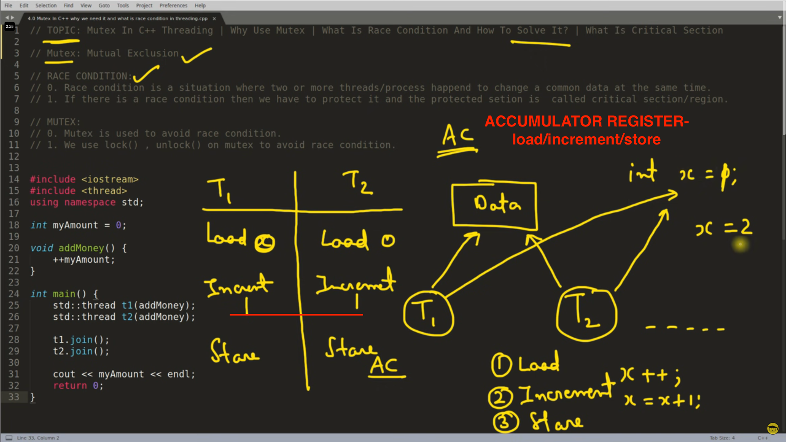
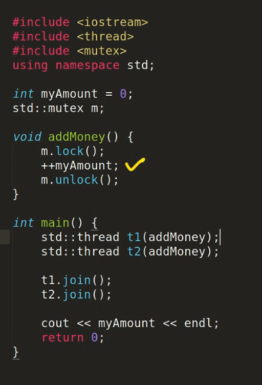

# Multithreading in C++
allows you to execute multiple threads concurrently, enabling parallelism and improving the performance of your applications. To work with multithreading in C++, you'll need to include the  #include __thread__ header.


Include the necessary header: Add the following line at the beginning of your C++ program to include the __<thread>__ header:

```cpp

#include <thread>
// Create a thread: To create a new thread, you need to define a function or lambda that will be executed concurrently. Here's an example of a function that prints a message:

void printMessage() {
    std::cout << "Hello from thread!" << std::endl;
}
// Launch a thread: To launch a thread, use the std::thread class, passing the function or lambda as a parameter. Here's how you can launch a thread:

std::thread t1(printMessage);
// Wait for a thread to finish: If you want the main thread to wait for the spawned thread to finish its execution, use the join() function on the thread object. Here's how you can wait for the thread to finish:


t1.join();
// The join() function blocks the execution of the main thread until the specified thread finishes.


#include <iostream>
#include <thread>

void printMessage() {
    std::cout << "Hello from thread!" << std::endl;
}

int main() {
    // Create a thread and launch it
    std::thread t1(printMessage);

    // Wait for the thread to finish
    t1.join();

    // Continue with the main thread
    std::cout << "Hello from main thread!" << std::endl;

    return 0;
}
// In this example, the main thread creates a new thread using the printMessage() function and waits for it to finish using join(). Once the spawned thread completes, the main thread continues execution and prints its own message.
```

Multithreading introduces the possibility of race conditions and other synchronization issues. It's important to properly synchronize shared data between threads using synchronization primitives like mutexes, condition variables, or atomic operations to avoid data races and ensure correct behavior.

# MUTEX IN C++

> ## above myAmount should have been 2 , but it is 1 due to race condition

## -> the idea is that the while one thread uses the cirtical section, other thread must wait for the mutex to get free



# MUTEX VS SEMAPHORES
### Imagine you have a single bathroom shared by multiple people in an office building.

### - Mutex: Think of a mutex as a key to the bathroom. Only one person can hold the key (mutex) at a time. When a person wants to use the bathroom, they must acquire the key (lock the mutex) before entering. If another person tries to acquire the key while someone else is using the bathroom, they have to wait until the key is released (mutex is unlocked). The mutex enforces mutual exclusion, allowing only one thread (person) to access a shared resource (bathroom) at a time. It guarantees that concurrent access to the shared resource is sequential, preventing conflicts and race conditions.

### - Semaphore: Now, imagine a semaphore as a counter representing the number of available bathroom stalls. Let's say the semaphore is initialized with a value of 3, indicating that three bathroom stalls are available. When a person wants to use the bathroom, they check if any stalls are available (value of semaphore > 0). If there is an available stall, they enter the bathroom, and the semaphore value is decremented (one less available stall). If all stalls are occupied, the person has to wait until a stall becomes available (value of semaphore > 0). When a person finishes using the bathroom and leaves, the semaphore value is incremented (one more available stall). The semaphore allows multiple threads (people) to access the shared resource (bathroom) simultaneously, up to a certain limit defined by the semaphore value. It provides a way to control access to a limited set of resources.

In summary:

> ### Mutex ensures exclusive access to a shared resource, allowing only one thread at a time (like a key to a bathroom).
---
> ### Semaphore controls access to a limited set of resources, allowing multiple threads up to a defined limit (like the number of available bathroom stalls).
Both mutex and semaphores are synchronization primitives used in concurrent programming to coordinate access to shared resources. The choice between mutex and semaphores depends on the specific requirements of the situation and the desired behavior for resource access.

## RESOURCES
- https://www.youtube.com/playlist?list=PLk6CEY9XxSIAeK-EAh3hB4fgNvYkYmghp
