> # DYNAMIC PROGRAMMING ALL PATTERNS

- [Part 1: 1D DP](#1d-dp)

- [Part 2: Multidimensional DP](#multidimensional-dp)

- [Part 3: DP on Subsequences](#dp-on-subsequences)

- [Part 4: DP on Strings](#dp-on-strings)

- [Part 5: DP on Stocks](#dp-on-stocks)

- [Part 6: DP on LIS](#dp-on-lis)

- [Part 7: MCM or Partition DP](#mcm-or-partition-dp)

- [Part 8: DP on Squares](#dp-on-squares)

# 1D-DP
## DISTINCT WAYS TO CLIMB STAIRS
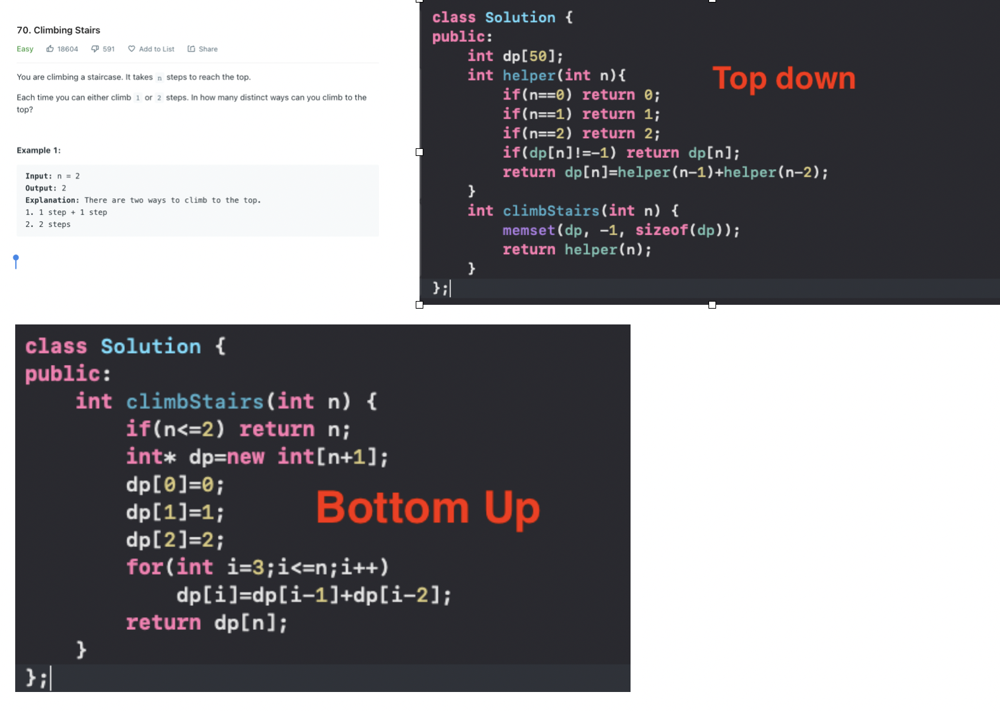

# Multidimensional DP
# DP on Subsequences
# DP on Strings
# DP on Stocks
# DP on LIS

# MCM or Partition DP
## 0. MATRIX CHAIN MULTIPLICATION
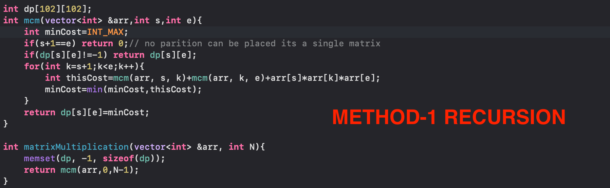
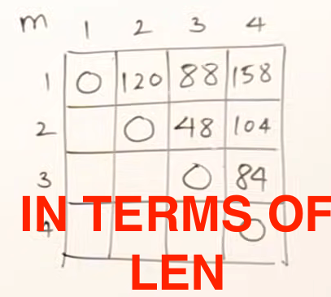
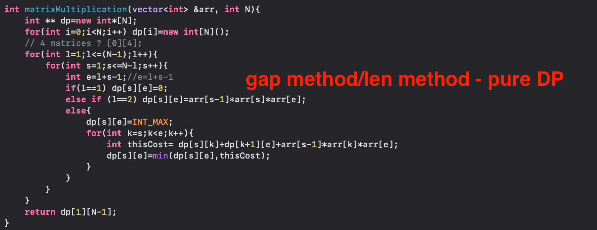
---
---
---
---
---
---
---
---
## 1. NUMBER OF WAYS TO EVALUATE BOOLEAN EXPERESSION TO TRUE
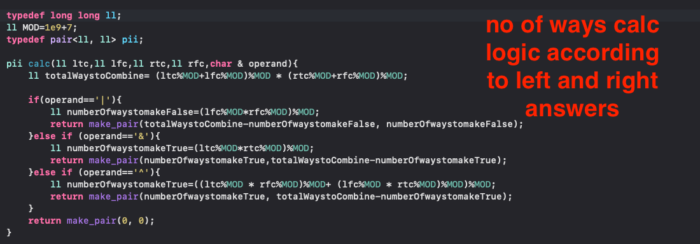
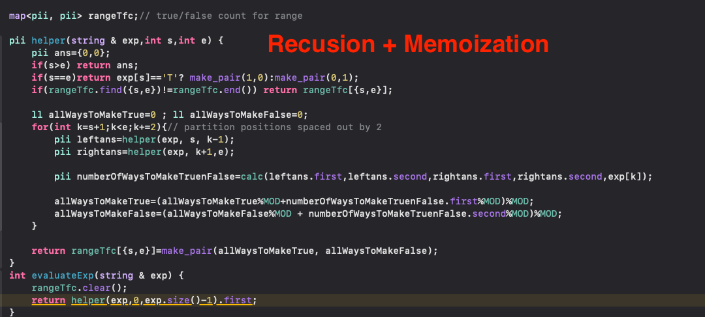
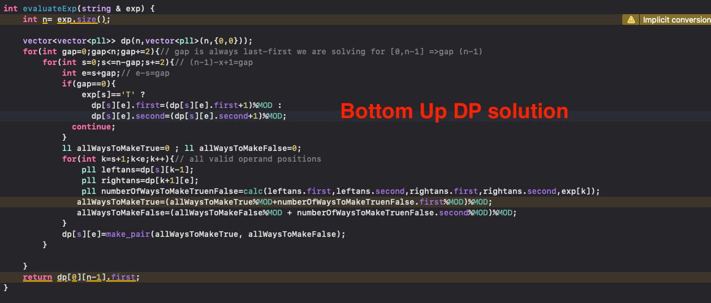
---
---
---
---
---
---
---
---
## 2. ROD CUTTING PROBLEM
### Cut Stratergy vs Left and right half stratergy
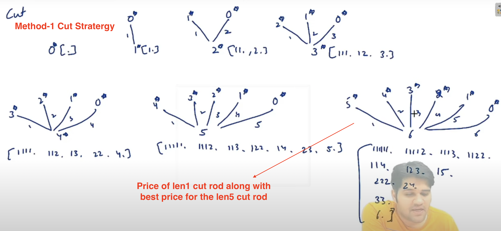
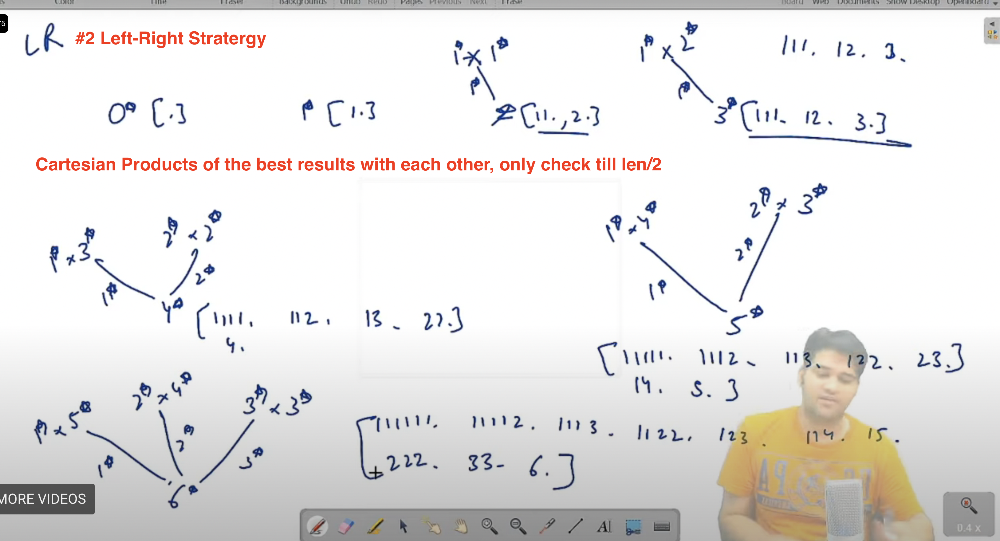
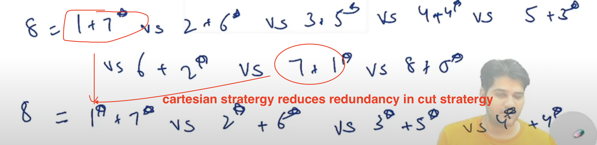
(5 above means the given price for 5 , whereas 5* means the best price of a 5 len rod found after optimal cutting and selling)
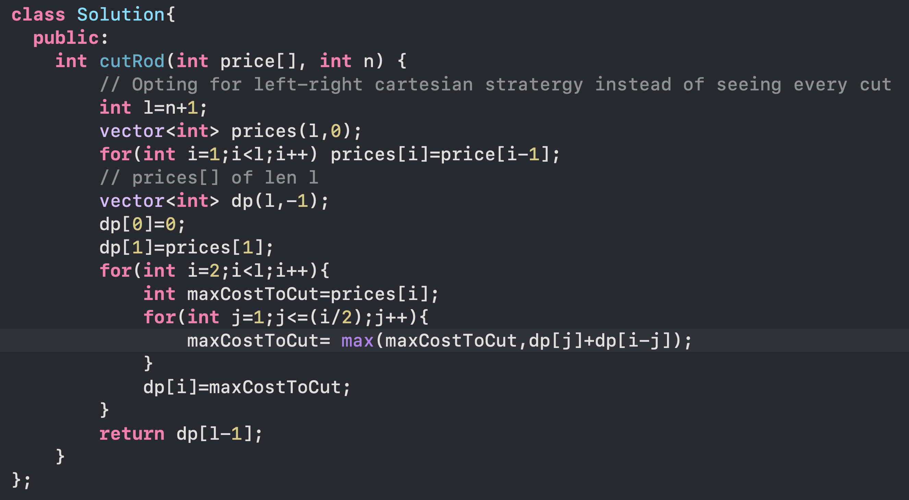
---
---
---
---
---
---
---
---
## .3 PALINDROME PARTITIONING 2
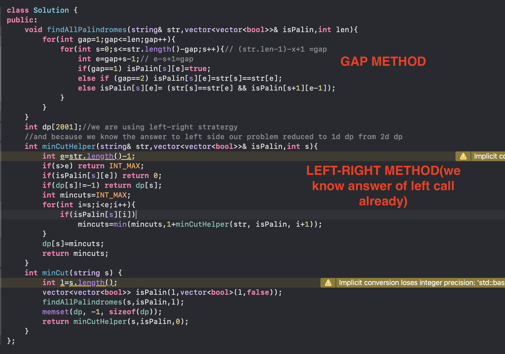
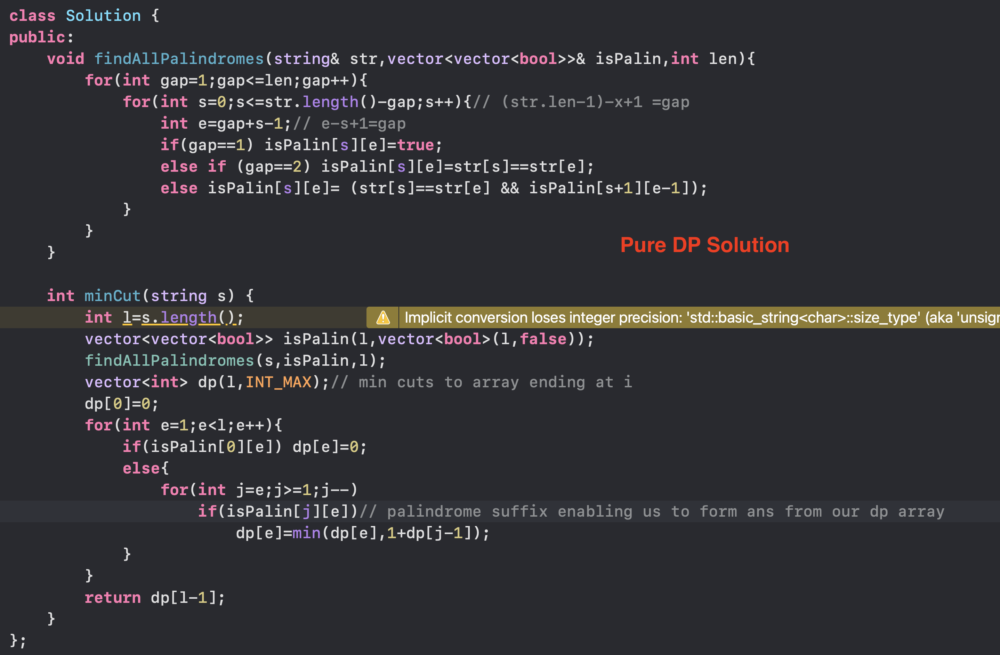
---
---
---
---
---
---
---
---

# DP on Squares
