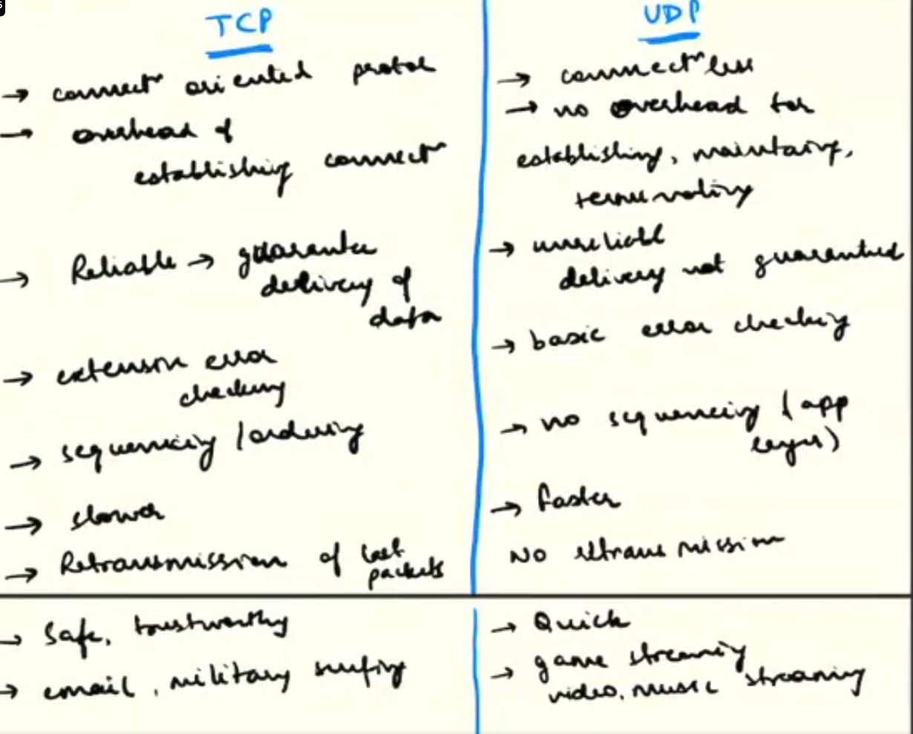
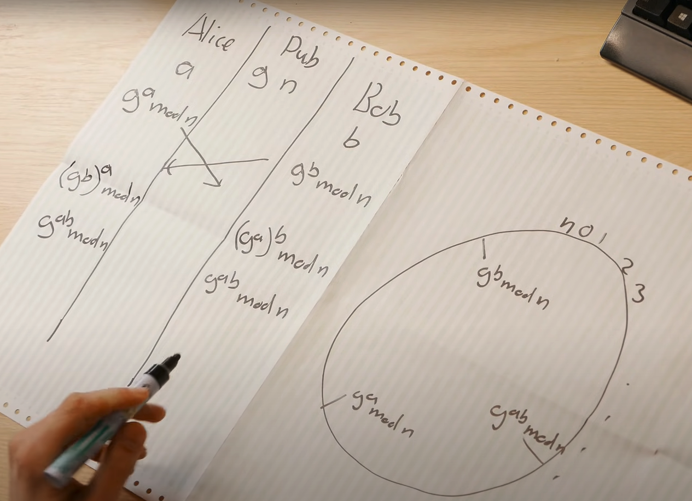

# Client server architecture

## Mechanisms of Communication
- The OSI (Open Systems Interconnection) model and the TCP/IP (Transmission Control Protocol/Internet Protocol) model are both conceptual frameworks that define the functions and protocols required for communication between different computer systems and networks.
- These models were developed to standardize and facilitate communication in networked environments. The reason for having two models lies in their historical development and industry adoption.

### 1. OSI Model (Open Systems Interconnection Model):
- The OSI model was introduced in the early 1980s by the International Organization for Standardization (ISO) to provide a standardized framework for network communication.
- It consists of seven layers, each representing a specific set of functions necessary for communication between two devices in a network. The layers are:

7. Physical Layer: Deals with the physical medium and transmission of raw bits over the network.

6. Data Link Layer: Provides reliable data transfer across the physical link, including error detection and correction.

4. Network Layer: Handles logical addressing and routing of data packets between different networks.

4. Transport Layer: Ensures reliable data delivery end-to-end, dealing with segmentation, flow control, and error recovery.

3. Session Layer: Manages sessions or connections between applications running on different devices.

2. Presentation Layer: Responsible for data translation, encryption, and compression, ensuring data is presented in a readable format.

1. Application Layer: This is the topmost layer and contains network applications that interact directly with end-users, such as web browsers, email clients, etc.

### 2. TCP/IP Model (Transmission Control Protocol/Internet Protocol Model):
- The TCP/IP model is a more practical and widely implemented networking model. It was developed by the Department of Defense (DoD) during the 1970s to create the foundation for the internet.
- It comprises four layers:

1. Application Layer: Similar to the OSI model's Application Layer, this layer provides network services directly to applications and end-users.
2. Transport Layer: This layer combines the functions of OSI's Transport and Session layers, handling end-to-end communication and flow control.
3. Internet Layer: Corresponds to the Network Layer in the OSI model, managing packet routing across different networks.
4. Link Layer: Equivalent to both the Data Link and Physical Layers in the OSI model, responsible for data framing, physical addressing, and transmission over the local network medium.

### Differences between OSI and TCP/IP Models:
The main differences between the OSI model and the TCP/IP model are:

- Number of Layers: The OSI model has seven layers, while the TCP/IP model has four layers. The TCP/IP model combines some of the functions of the OSI model's layers to create a simpler framework.

- Development: OSI was developed as a theoretical model before the widespread use of networks, whereas TCP/IP was developed based on real-world implementation to build the internet.

- Adoption: TCP/IP became the dominant model for networking due to its direct association with the internet. Most modern networks and the internet itself are built on TCP/IP.

- Encapsulation: The OSI model uses the process of data encapsulation, where data is successively wrapped with headers as it moves down the layers. The TCP/IP model uses a similar process, but with fewer layers, leading to a more straightforward encapsulation process.

> #  In context of system design and software dev its important to understand the Application layer and Transport layer , specifically their protocols

### The Transport layer

1. Responsibilities of the Transport Layer:

- Providing end-to-end communication and data transfer between applications on different devices.
- Segmenting and reassembling data to facilitate efficient transmission.
- Ensuring reliable data delivery by implementing error detection and recovery mechanisms.
- Implementing flow control to manage the rate of data transmission between sender and receiver.
- Multiplexing and demultiplexing multiple applications or processes running on the same device.

2. Mechanisms of the Transport Layer:

- Segmentation and Reassembly: Breaking data into smaller segments for transmission and reassembling received segments into the original data at the destination.
- Error Detection and Correction: Adding checksums or sequence numbers to data segments for error detection, and requesting retransmission of corrupted or lost segments.
- Flow Control: Regulating the rate of data transmission to avoid overwhelming the receiver and prevent packet loss due to buffer overflow.
- Multiplexing/Demultiplexing: Allowing multiple applications or processes to share the same network connection by using port numbers to identify different services.

3. Protocols of the Transport Layer:
#### TCP (Transmission Control Protocol):
Responsibilities:

- Connection-oriented protocol: Establishes a reliable and full-duplex connection between sender and receiver before data exchange.
- Error checking and recovery: Uses sequence numbers and acknowledgments for reliable data delivery.
- Flow control: Employs a sliding window mechanism to manage data flow.
- Congestion control: Reacts to network congestion by adjusting the data transmission rate.

Mechanisms:

> - Three-way handshake initiation: SYN, SYN-ACK, ACK packets are exchanged to establish a connection.
- Reliable data delivery: Uses sequence numbers and acknowledgments to ensure data is received in order and without errors.
- Sliding window: Controls the amount of unacknowledged data that can be in-flight at any given time.
> - Four-way handshake initiation: FIN, FIN&ACK, ACK packets are exchanged to terminate a connection.
#### UDP (User Datagram Protocol):

Responsibilities:

- Connectionless protocol: No connection setup is required before data exchange.
- Best-effort delivery: Does not guarantee reliable data delivery or error recovery.
- Suitable for real-time applications or scenarios where low overhead is preferred.

Mechanisms:

- No handshake or connection setup: Data can be sent immediately without establishing a connection.
- No flow control or congestion control: The sender can transmit data at its own rate without regulating it based on network conditions.
- Simplicity: UDP has less overhead compared to TCP, making it suitable for low-latency applications.
#### SCTP (Stream Control Transmission Protocol):

Responsibilities:

- Provides support for multi-streaming and multi-homing, making it suitable for scenarios requiring robustness and fault tolerance.
- Designed for reliable transport of telephony signaling messages over IP networks.
Mechanisms:

- Multi-streaming: Allows data to be broken into multiple streams, each with its own sequence numbers and flow control.
- Multi-homing: Supports multiple network interfaces, providing fault tolerance and improved resilience.
#### Some applications of transport layer protocols

- TCP (Transmission Control Protocol) - Web browsing, email (SMTP, POP3), file transfer (FTP), etc.
- UDP (User Datagram Protocol) - Real-time communication (VoIP, video conferencing, online gaming), DNS, DHCP, etc.
- SCTP (Stream Control Transmission Protocol) - Telephony signaling, SIP-based voice and video communication.
- DCCP (Datagram Congestion Control Protocol) - Multimedia streaming, online gaming.
- RSVP (Resource Reservation Protocol) - Quality of Service (QoS) management in networks.
- L2TP (Layer 2 Tunneling Protocol) - VPN tunneling and encapsulation.
- ICMP (Internet Control Message Protocol) - Network diagnostics, error reporting (ping, traceroute).
- SPX (Sequenced Packet Exchange) - Legacy protocol used in Novell NetWare networks.
- RUDP (Reliable UDP) - Reliable data transfer over UDP.
- IL (InterLan) - Legacy protocol used in early Ethernet networks.
- SIP (Session Initiation Protocol) - VoIP (Voice over Internet Protocol) call setup and management.
- RTSP (Real-Time Streaming Protocol) - Streaming media control (e.g., video streaming).
> - QUIC (Quick UDP Internet Connections) - Low-latency and secure data transfer, used by modern web browsers.
- iSCSI (Internet Small Computer System Interface) - SCSI storage protocol over IP networks.
- MPLS (Multiprotocol Label Switching) - Packet forwarding and QoS support in high-performance networks.
- IPsec (Internet Protocol Security) - Secure communication and encryption for IP networks.
- PPTP (Point-to-Point Tunneling Protocol) - VPN tunneling (legacy protocol, less secure).
- GRE (Generic Routing Encapsulation) - Tunneling protocol to encapsulate various network layer protocols.

(also in UDP broadcasting is supported)

### The Application layer
1. Responsibilities of the Application Layer:

- topmost layer
- Providing a user interface and enabling interaction between users and the application.
- Offering network services directly to end-users, allowing them to access network resources and perform specific tasks.
- Deciding on the appropriate data formats and protocols for communication with other applications.

2. Mechanisms of the Application Layer:

- Data Formatting: Ensuring that data is structured in a way that both the sender and receiver can understand. This includes defining data formats such as JSON, XML, or plaintext.
- Encryption/Decryption: Secure communication between applications is achieved using encryption techniques like SSL/TLS to encrypt data during transmission and decrypt it at the recipient's end.

- Compression: Reducing the size of data before transmission to optimize bandwidth usage and improve performance.

- Session Management: Handling the establishment, maintenance, and termination of sessions between applications or clients and servers.
- Error Handling: Implementing error detection and recovery mechanisms to ensure reliable data transfer.
- Authentication and Authorization: Verifying the identity of users or applications and granting appropriate access permissions to network resources.
- Resource Discovery: Facilitating the location of network resources or services through mechanisms like DNS (Domain Name System).
- Content Negotiation: Allowing clients and servers to agree on the best data format or language to use during communication.
- Caching: Storing frequently accessed data locally to reduce the need for repeated requests to the server.

3. Protocols and Examples of the Application Layer:
HTTP (Hypertext Transfer Protocol): Used for web browsing, retrieving web pages, and transferring data between clients and servers.
HTTPS (HTTP Secure): A secure version of HTTP that employs SSL/TLS encryption for secure web communication.
SMTP (Simple Mail Transfer Protocol): Sending and relaying email messages between email servers.
POP3 (Post Office Protocol version 3): Retrieving email messages from a remote mail server to a client's device.
IMAP (Internet Message Access Protocol): Allowing clients to access and manage email messages stored on a remote mail server.
DNS (Domain Name System): Resolving domain names into IP addresses, translating human-readable names to numerical IP addresses for internet communication.
FTP (File Transfer Protocol): Transferring files between a client and server, often used for website hosting or file sharing.
SSH (Secure Shell): Securely accessing and managing remote devices over a network using encrypted communication.
SNMP (Simple Network Management Protocol): Monitoring and managing network devices and equipment.
LDAP (Lightweight Directory Access Protocol): Accessing and maintaining directory services, often used for centralized user authentication and authorization.

4. Underlying Transport layer protocols of application layer protocols

- HTTP (Hypertext Transfer Protocol): TCP (Transmission Control Protocol)
- HTTPS (HTTP Secure): TCP (Transmission Control Protocol) with SSL/TLS encryption
- SMTP (Simple Mail Transfer Protocol): TCP (Transmission Control Protocol)
- POP3 (Post Office Protocol version 3): TCP (Transmission Control Protocol)
- IMAP (Internet Message Access Protocol): TCP (Transmission Control Protocol)
- DNS (Domain Name System): UDP (User Datagram Protocol) and TCP (Transmission Control Protocol)
- FTP (File Transfer Protocol): TCP (Transmission Control Protocol)
- SSH (Secure Shell): TCP (Transmission Control Protocol)
- SNMP (Simple Network Management Protocol): UDP (User Datagram Protocol) and TCP (Transmission Control Protocol)
- LDAP (Lightweight Directory Access Protocol): TCP (Transmission Control Protocol)
- Telnet: TCP (Transmission Control Protocol)
- NTP (Network Time Protocol): UDP (User Datagram Protocol) and TCP (Transmission Control Protocol) for some operations
- RDP (Remote Desktop Protocol): TCP (Transmission Control Protocol)
- SMTPS (Secure SMTP): TCP (Transmission Control Protocol) with SSL/TLS encryption
- NNTP (Network News Transfer Protocol): TCP (Transmission Control Protocol)
- POP3S (Secure POP3): TCP (Transmission Control Protocol) with SSL/TLS encryption
- SIP (Session Initiation Protocol): UDP (User Datagram Protocol) and TCP (Transmission Control Protocol)
- HTTP/2: TCP (Transmission Control Protocol) with multiplexing and other performance enhancements
- WebSocket: TCP (Transmission Control Protocol)
- MQTT (Message Queuing Telemetry Transport): TCP (Transmission Control Protocol) or WebSocket

5. Chronology of development of HTTP

1. HTTP/0.9 (1991):
    - This version was the first version of HTTP.
    - It was extremely basic and supported only one HTTP method, which was "GET."
    - HTTP/0.9 was used for fetching HTML documents and displaying them in early web browsers.
    - There was no header support, and the server could only respond with the content of the requested resource.
2. HTTP/1.0 (1996):
    - It added support for multiple request methods like GET, POST, HEAD, and others.
    - HTTP/1.0 introduced request and response headers, enabling the transfer of additional information with the HTTP messages.
    - It also introduced status codes (e.g., 200 OK, 404 Not Found) to indicate the success or failure of a request.
    - Persistent connections were optional in HTTP/1.0, allowing multiple requests to be sent over the same connection.
3. HTTP/1.1 (1997): MOST WIDELY USED TILL DATE
    > - It introduced several optimizations, such as persistent connections by default, pipelining, and chunked transfer encoding for better data transmission.
    - In requests we can see a keep-alive header
    - Host headers were introduced to support multiple domains on a single IP address.
    - Content negotiation was introduced to allow servers to send different versions of a resource based on the client's preferences.
    - HTTP/1.1 brought significant improvements in performance and reduced the overhead of establishing new connections for each request.

    (HTTP persistent connection, also called HTTP keep-alive, or HTTP connection reuse, is the idea of using a single TCP connection to send and receive multiple HTTP requests/responses, as opposed to opening a new connection for every single request/response pair.)
4. HTTP/2 (2015):
    - One of the primary motivations for HTTP/2 was to reduce latency and improve page load times, especially for modern web applications.
    - It introduced multiplexing, allowing multiple requests to be sent and received over a single TCP connection simultaneously, eliminating the head-of-line blocking problem.
    - HTTP/2 also included server push, where servers can proactively send resources to the client before they are requested, further improving page load times.
    - Header compression was introduced to reduce the size of HTTP headers, saving bandwidth and improving performance.
    - Prioritization of requests was introduced to ensure that more important resources are fetched first.
5. HTTP/3 :(2020)
    > - HTTP/3 is designed to use the QUIC (Quick UDP Internet Connections) transport protocol, which operates over UDP.This major departure from the traditional HTTP versions using TCP
    - QUIC provides better congestion control and reduced latency compared to TCP, further enhancing web performance.
    - HTTP/3 is expected to bring improvements in data transmission and performance, especially in scenarios with high packet loss or network congestion.
> 6. HTTPS (HTTP Secure):
    - HTTPS is not a separate version of HTTP but rather an extension that adds a security layer to the HTTP protocol.
    - HTTPS encrypts the data transmitted between the client and server, ensuring that it remains secure and protected from eavesdropping and tampering.
    - HTTPS is implemented using SSL/TLS (Secure Socket Layer/Transport Layer Security) protocols.
    - It is essential for securing sensitive data, such as login credentials, personal information, and financial transactions, over the internet.
    - HTTPS helps protect against man-in-the-middle attacks and ensures the authenticity of the website by using digital certificates

6. HTTP METHODS
- The main differences between these HTTP methods lie in their intended operations and their idempotent nature.
    - The GET method is used to retrieve data from the server.
        - It is idempotent, meaning that making the same GET request multiple times will have the same result, and it does not modify the server state.
        - Parameters are typically appended to the URL as query strings.
        - It is the most widely used method for fetching web pages, images, and other resources from servers

    - The POST method is used to submit data to be processed to the server.
        - It is not idempotent, meaning that making the same POST request multiple times may have different effects on the server's state.
        - It is commonly used for form submissions, file uploads, and other operations that require data to be sent to the server.

    - The PUT method is used to update or create a resource at a specific URL.
        - If the resource already exists, it will be updated with the new data; otherwise, a new resource will be created.
        - It is idempotent, as multiple identical PUT requests will have the same effect on the resource.

    - The DELETE method is used to remove a resource from the server.
        - It is idempotent, meaning that making the same DELETE request multiple times will have the same effect (i.e., the resource will be deleted).

    - The PATCH method is used to apply a partial update to a resource.
            - It is used when only a portion of the resource needs to be modified, rather than replacing the entire resource as in PUT.
            - PATCH is not guaranteed to be idempotent and should be carefully implemented to ensure consistency.

    - The HEAD method is similar to GET but retrieves only the response headers, not the actual content.
            - It is used to check the status of a resource or to fetch metadata about a resource without retrieving the entire payload.

    - The OPTIONS method is used to retrieve information about the communication options available for a resource or server.
            - It allows clients to determine which methods are supported by the server, among other capabilities.

    - The TRACE method is used to retrieve a diagnostic trace of the request and response messages for testing and debugging purposes.
            - It is rarely used in practice due to security concerns, as it may expose sensitive information.

    - The CONNECT method is used to establish a network connection to a resource via a proxy server.It is commonly used in HTTPS proxying.

### ENCRYPTION IN NETWORK COMMUNICATION
### Encryption in HTTPS:
- HTTPS (Hypertext Transfer Protocol Secure) is an extension of HTTP that adds a security layer using encryption to protect data exchanged between a client (usually a web browser) and a web server.

- HTTPS is achieved using SSL (Secure Socket Layer) or TLS (Transport Layer Security) protocols, collectively referred to as SSL/TLS. These protocols use encryption algorithms to encrypt the data before sending it and then decrypt it upon receipt.

### Symmetric Encryption:
- In symmetric encryption, the same secret key is used for both encryption and decryption.
- Both the sender and receiver must possess the shared key to communicate securely.

- The key is kept secret and must be securely distributed between the communicating parties before they start exchanging data.

Mechanism:

- Key Generation: A secure random key is generated by one party (e.g., the server) and shared with the other party (e.g., the client).
- Encryption: The sender uses the shared secret key to encrypt the data before transmission.
- Decryption: Upon receiving the encrypted data, the receiver uses the same shared secret key to decrypt the data and access the original content.
- Symmetric encryption is efficient and faster compared to asymmetric encryption but poses a challenge when it comes to securely distributing the shared key between the communicating parties, especially over an untrusted network.
- Diffie hellman key exchange is how we get the same key across , a takes bg and makes abg , similarly b take ag and make abg again , the man in the middkle only has ag/bg/g/n- getting a(private) or b(private) from ag/bg even after having g is very hard
- nc2 keys required for a n network graph

Asymmetric Encryption:
- Asymmetric encryption (also known as public-key cryptography) involves two different but mathematically related keys: a public key and a private key.
- The public key is openly shared, while the private key is kept secret and never shared.

Mechanism:

- Key Pair Generation: Each party generates a key pair consisting of a public key and a private key.
- Public Key Sharing: The public keys are openly shared and can be distributed widely, even over untrusted networks.
- The message encypted by public key of A can ONLY be decypted by using private key of A
- Encryption/Decryption: When a sender wants to send encrypted data to a recipient, they use the recipient's public key to encrypt the data. ie A sending to B ,
    encyptps from public key of B , now only the preson which knows B private key can decrypt it - which is obviously only B.
- Asymmetric encryption eliminates the need for securely distributing a shared secret key, making it suitable for securely exchanging information in an untrusted environment. However, it is computationally more intensive and slower than symmetric encryption.
- RSA is how asymmetric keys are created (https://youtu.be/sBO3gH1uGzQ)
- 2n keys required for a n network graph

### HTTPS Encryption Process:
> ## Symmetric key exchange is more efficient but comparatively less secure preferable for large amount of data, asymmetric key change is more expensive,
> ## HHTP smartly uses symmetric key encyption by using asymmetric key transfter mechanism to exchange the sercet key ! getting best of both worlds
HTTPS uses a combination of both symmetric and asymmetric encryption to secure the communication between a client (typically a web browser) and a web server. The process involves the following steps:

1. Server Authentication (Asymmetric Encryption):

- When a client initiates an HTTPS connection to a server, the server responds with its digital certificate.
- The digital certificate contains the server's public key, which is used for asymmetric encryption.
- The client verifies the authenticity of the server's digital certificate, ensuring that the server is who it claims to be and that the public key belongs to the server.

2. Key Exchange (Asymmetric Encryption):

- After the server is authenticated, the client generates a random symmetric encryption key (session key).
- The client encrypts this session key using the server's public key from the digital certificate.
- The encrypted session key is sent back to the server.

3. Data Encryption (Symmetric Encryption - facilitated by previous asymmetric encyption):

- Once the server receives the encrypted session key, it decrypts it using its private key (asymmetric decryption) to obtain the shared session key.
> - Both the client and the server now have the same symmetric session key.
> - All subsequent communication during the HTTPS session will use symmetric encryption with this shared session key.
- The symmetric encryption is much faster and efficient than asymmetric encryption, making data transmission efficient during the session.

# REALTIME COMMUNICATION MECHANISMS

## 1. Short Polling
    - Short polling is a more traditional polling mechanism where the client sends periodic requests to the server at regular intervals to check for updates. The server responds with the latest data, whether new data is available or not. If no updates are available, the client has to wait until the next polling interval to check again.
    - Real-time monitoring: Short polling can be used to monitor the status of devices, services, or metrics, where real-time data is not critical, and data updates are not frequent.
## 2. Long Polling
    - Long polling is a technique where the client sends an HTTP request to the server, and the server holds the request open until new data is available or a timeout occurs. When new data is available, the server responds to the request, and the client processes the response. After processing the response, the client immediately sends another request to the server, and the process repeats.
## 3. Server-Sent Events (SSE):
    - SSE is a unidirectional communication channel from the server to the client. It uses standard HTTP connections to allow the server to send continuous streams of data (events) to the client over a single HTTP connection.

    - Real-time news and updates: SSE can be used to provide real-time news updates or live scores to clients without the need for continuous polling.
    - Stock market tickers: SSE can be used to display real-time stock market data, providing live updates to clients.
## 4. 4. WebSockets:
    - WebSockets provide bidirectional, full-duplex communication channels between the client and server over a single TCP connection.
    - no overhead of http headers
    - Unlike HTTP, WebSockets maintain a persistent connection, allowing real-time data transmission in both directions without the overhead of continuously establishing new connections.
    - Real-time chat applications: WebSockets are widely used in real-time chat applications, enabling seamless bidirectional communication between users.
    - Online gaming: WebSockets allow for real-time interactions in online multiplayer games, ensuring low-latency data exchange between players and the game server
