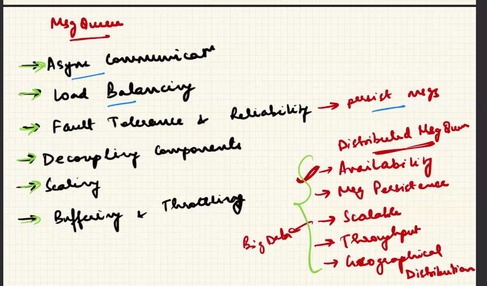
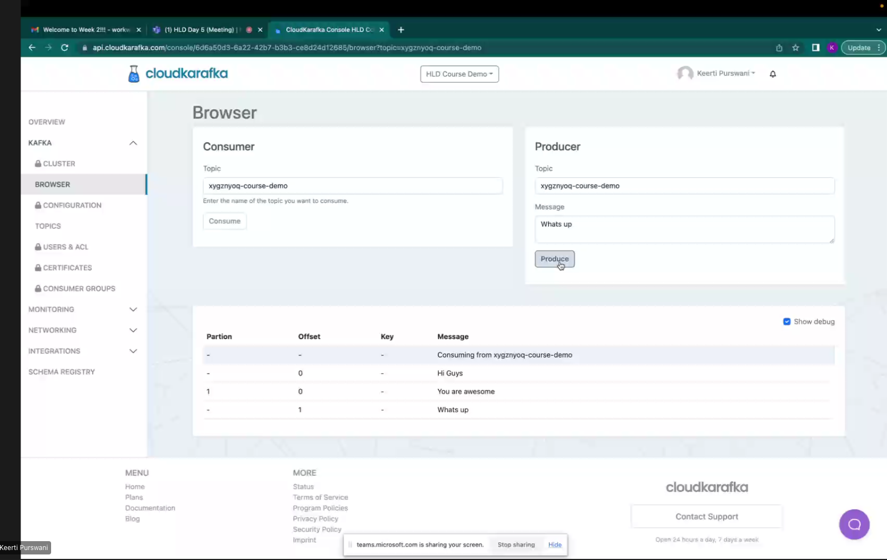
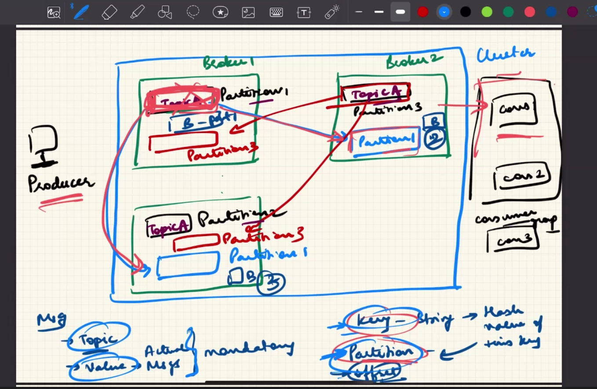
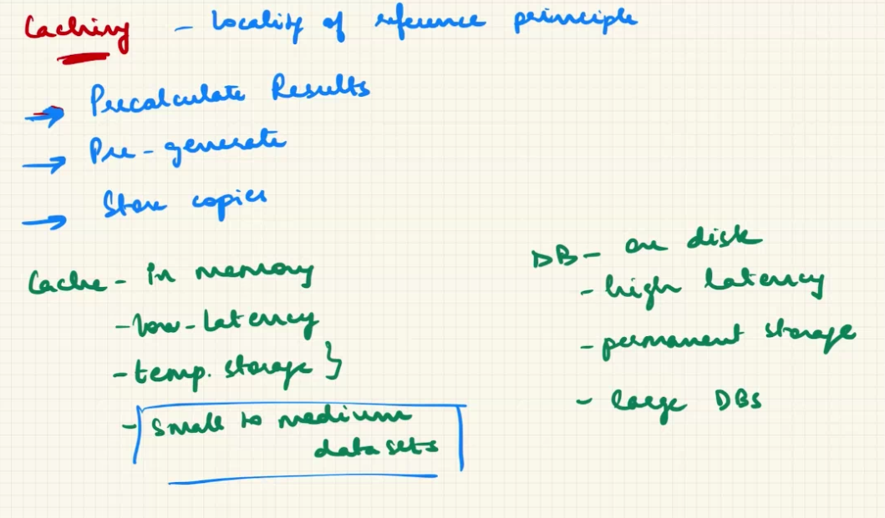

- not only distributed backend, there are distributed dbs as well as file systems
- you can have backup or have something like master-slave architecture
- The leader db takes cares of read/write operations , the other dbs are just replicas they may be used for read requests only -if read traffic is more
- needless to say in above configuration its a task to maintain consistency of data - they are "evtually" consistent- EVENTUAL CONSISTENCY
- STRONG CONSISTNECY : banking , ATM
- How to have strong consistency ? - synchrinous replication, ie write request would include writing and syncronising,in fact it would first write to slave servers and then itself
- There is also something called read your write consistency
- strong consistemcy requires synchronous replication
- Functional requirements - flow related , functinality related
- Non Functal req- ensure our system works efficiently - generally hidden from user
- 25:11

- Delayed Jobs - async actions
- One server was getting overwheled we added a queue
- Order mangement server and delivery server (delayed )
- should be put in the queue first ? then send ok  or send ok and then send
- Message queues vs Distributed message queues
- when to use grpc (sync) ? when to use message queues(async) ?
- message queues -> sort of load balancing -> throwput control
- throwput -> no of requests we can process
- Fault tolerance =>
- reliabelity
- decouping the components
- helps in scaling- add more message queus to handle more throwput
- buffering and throttling(limiting number of requests to the consumer)
- avoids overwheling the server
- NON DISTRIBUTED MSG Q -> redis queue
- its available , consistent , scalable , geographical distribution, reliable
- kafka and rabbitMQ are two distributed message queues
- what if there are multiple consumers for the same event ? - pubSub Model
- one to one vs one to many communicatinn
- in some cases we might need sync and other are async , we can have a message q or distributed message q,

- kafka has mesages categorised by topics, each topic has partitions
- which message to whic consumer - particulat message particalu topic
- messages divided into partitions
- partitions kept in different servers
- kafka cluster
- a cluster has many servers
- requests divided into partitions
- paritions scale horizontally and help us handle more requests
- we are dividing one topic into partitions
-

- we create a topic and decide on partitions and replicas
- 
- why would "we" define partition?
- for same key partition will remain same - its decided by hash of the key
- within a parition at what level is the message

- Producer/Consumer , Cluster which has brokers , inside a broker for every mesage we have a topic,key,partition . There are partitions for every topic , there are replicas of partitions kept in different brokers
- consumers are grouped on topics - consumer groupd
- Zookeeper was used here
- partiitoins give parallerinsm for a particular topic
- leader election in kafka
- parallerism vs ordering
- dead letter queue
- msk kafka
- sqs
- kafka has very high thoughput
- where can we use kafka ? log-aggregation
- redis is NOT  distributed msg queue
- producer sends to exchange
- kafka - presistent , rabbitMQ- in-memory
- kafka vs rabbitMQ
- real time event streaming

- cache eviction policy
- dispatcher cache
- we deciede to cache when we have static unchanging data
- if data is modified in db it should be invalidated in cache - there is stale data in cache
- above is tradeoff between strong consisyency and evetual consitency

- Write Through cache: write in the cache and then in the DB- strong consitency and reliable but high latency
- Write Back cache : write to cache and go , update to real DB asynchornously, high throwput , not reliable , data integrity is at risk as cahce is volatile
- Write Around cache , inconsistnent , read performace issue
- common caches - redis , memcache both are key-value stores
- normal cache vs distributed cache
- all servers has one global cache - centerlaise cache ,within itself its distrubyted
- cache coherency - how coherent caches are among each other
- coherence , consistenct , less data redundancy
- redis is more used because it also has persistent storage, snashotting, its not compleletly volaite - its by default write back but can also configured to b write thru
- 
- Client side proxy - forward proxy, acts on behalf of client, sever does not know who is client
- Sever side proxy - reverse proxy , acts on behalf of sever
- forward proxy- for anonymity , content filtering , access control , caching
- reverse proxy- security , rate limiting , load balancing , caching, it can do SSL TERMINATION/HANDSHAKE
    sever is offloaded from encrption load
- API GATEWAY, LOAD BALANCER IS A TYPE OF REVERSE PROXT
- service routing is different from load balancing
- service directory has  map of service to IP
- CDN , what problem does it solve ? = latency, a combo of servers seperayed geographihcall - these servers are called POP- AKAMAI , CLOUDFRONT
