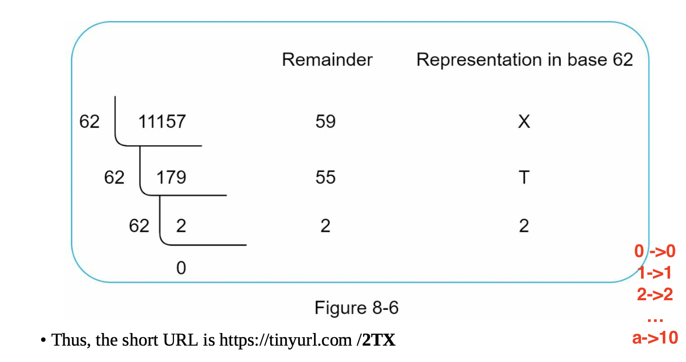
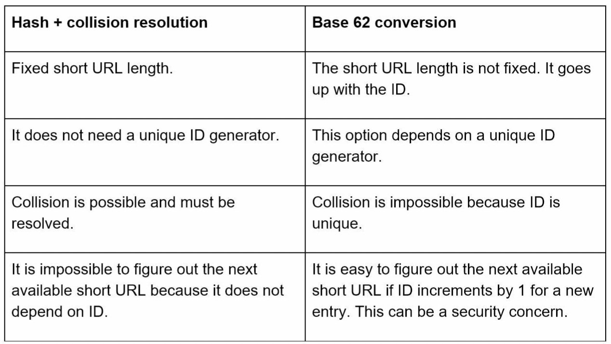
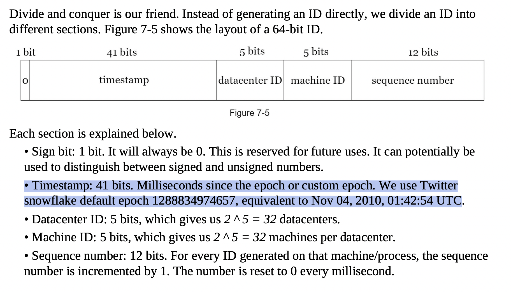
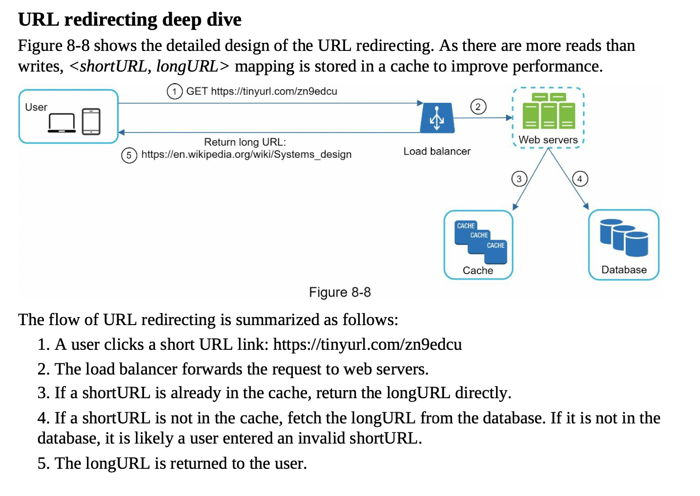
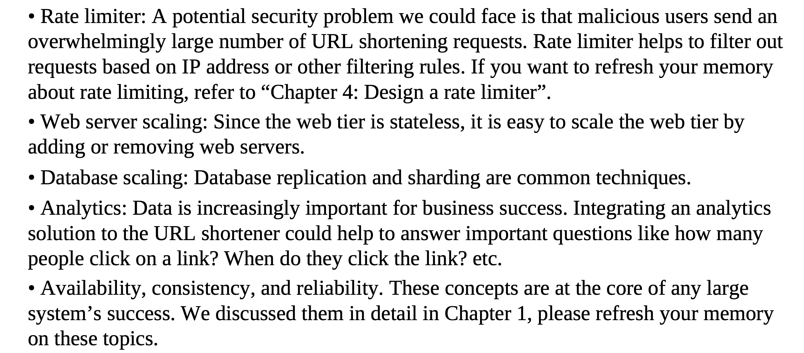

## 1. Define the Problem Space
    - Clarify Functional and Non-Functional Requirements
    - Fetch nitty-gritty details and then do back of the envelope calculations
---
## Functional Requirements
-  Given a long url give a short URL
-  Redirect person to long url when short url is clicked
## Non Functional Requirements
 - Highly available servie
 - Low latency service

## Nitty-gritty details
- URL can be as short as possible
- The traffic we are looking at is of the order of 100 million URLs are generated per day.
- We need to store the shortened URLS for 10 years
- Shortened URL can be a combination of numbers (0-9) and characters (a-z, A- Z). 62 chars total
- shortened URLs cannot be deleted or updated

## Back of the envelope calulations

- 100 * 10e6 * 365 * 10 = 3.65 * 10e11 is the number of unique requests we have (100 millions requests perday for 10 years)
- since we have 62 uniq chars available we need n digits to uniely indentify each request , where n is 62 ^n >= 3.65 * 10e11 , n is roughly 7 , the minimum possible
- so we need to generate a 7 digit key for each request

## 2. Design the system at a high level - diagram
    - Layout Fundametal peices
    - Start designing APIS , each requirement tranlates to one API
    - Communcation between client and web-server

---
## Fundamental design diagram

## APIS
- POST api/v1/data/shorten
    -  request parameter: {longUrl: longURLString} • return shortURL
- GET api/v1/shortUrl
    -  Return longURL for HTTP redirection

## 3/4. Deep Dive into the Design && Identify bottenecks and scaling opportunities
    - Details of how this works
    - Single point of failiure ? Data replication ? Data Consistency ? Scaling ?

## How to generate this hash value
### Method 1
- use a hash function
    - To shorten a long URL, we should implement a hash function that hashes a long URL to a 7- character string. A straightforward solution is to use well-known hash functions like CRC32, MD5(128bit), or SHA-1.
    - store <shortURL, longURL> mapping in a relational database

### Method 1 drawbacks
- none of the hashing algos give us exactly 7 length ,even the shortest hash value (from CRC32) is too long (more than 7 characters)
- The first approach is to collect the first 7 characters of a hash value; however, this method can lead to hash collisions. To resolve hash collisions, we can recursively append a new predefined string until no more collision is discovered
,This method can eliminate collision; however, it is expensive to query
-  A technique called bloom filters  can improve performance

### Method 2
- Use base 62 conversion
    - converting into base 62 as we are allowed base 62 chars
    - 
        
- 

## __The problem now boils down to creating a unique ID for each request in our distributed system__

# DESIGNING A UNIQUE ID GENERATOR IN DISTRIBUTED SYSTEMS
    - We cannot use a primary key with the auto_increment attribute like in a traditional database. auto_increment does not work in a distributed environment because a single database server is not large enough and generating unique IDs across multiple databases with minimal delay can cause collisions and even a centerlaised dedicated TICKETING SERVICE is a single point of failiure

## Twitter snowFlake approach

- our ids are unique owing to the timestamp and even each machines machine id we have in the middle
- another servive we can use is Apaches Zoo keeper it works by assigning different ranges to each request to service it

- we can also pad to url to reach 7 chars with base 62 conversion

## hence we see that we can go ahead with METHOD-2 (base 62 conversion)

## 5. Review and Wrap up

Resources :
- https://youtu.be/C7_--hAhiaM
