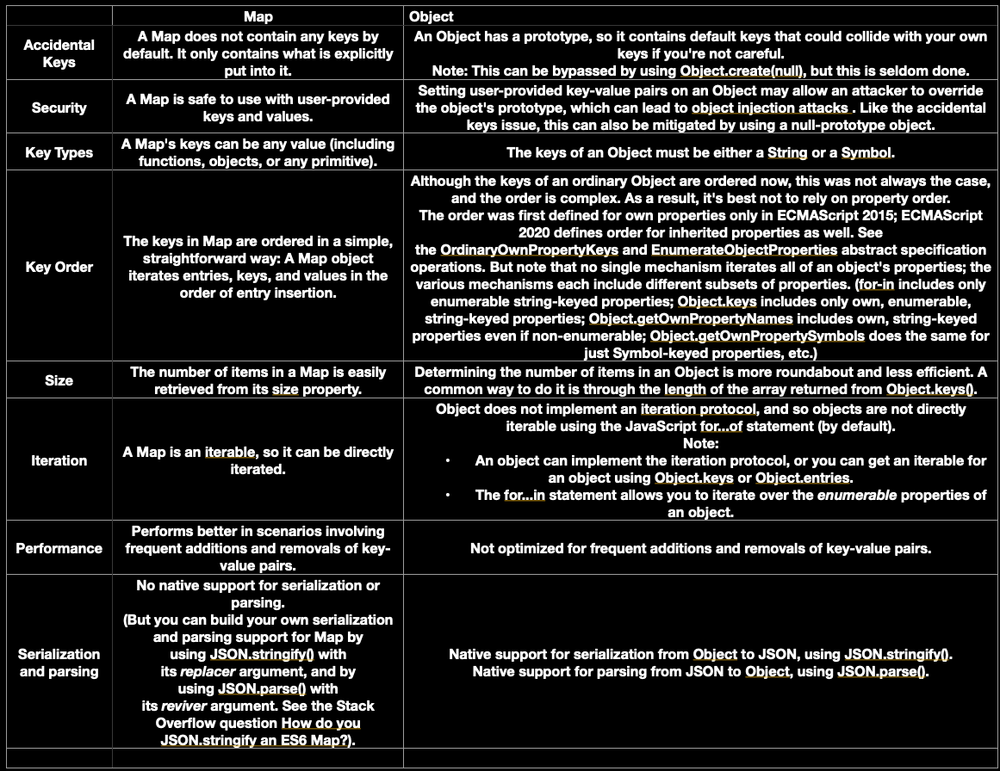

# MAP
- The Map object holds key-value pairs and remembers the original insertion order of the keys. Any value (both objects and primitive values) may be used as either a key or a value.
```js
const map1 = new Map();

map1.set('a', 1);
map1.set('b', 2);
map1.set('c', 3);

console.log(map1.get('a'));// Expected output: 1
map1.set('a', 97);
console.log(map1.get('a'));// Expected output: 97
console.log(map1.size);// Expected output: 3
map1.delete('b');
console.log(map1.size);// Expected output: 2
```
- A Map is ordered and iterable, whereas a objects is not ordered and not iterable
- **Key equality**
> NaN is considered the same as NaN (even though NaN !== NaN) and all other values are considered equal according to the semantics of the === operator.


