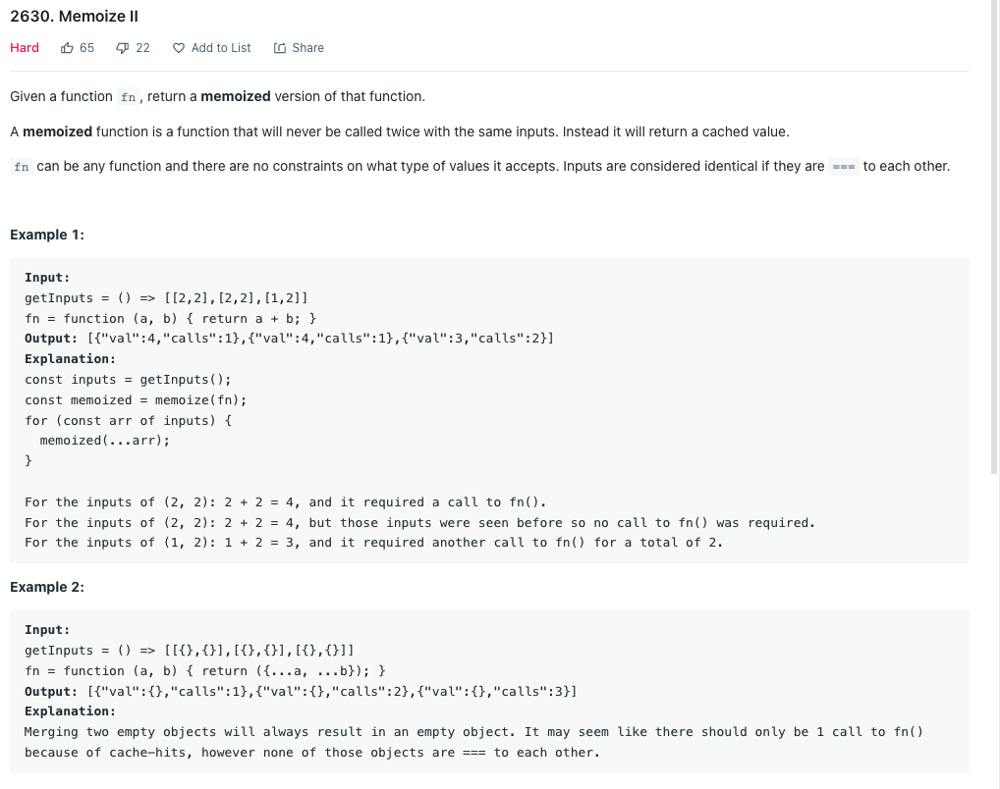
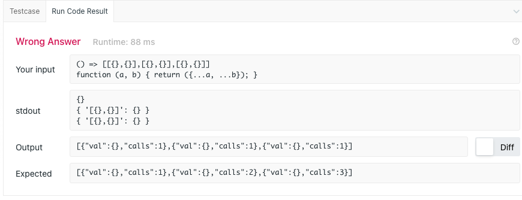
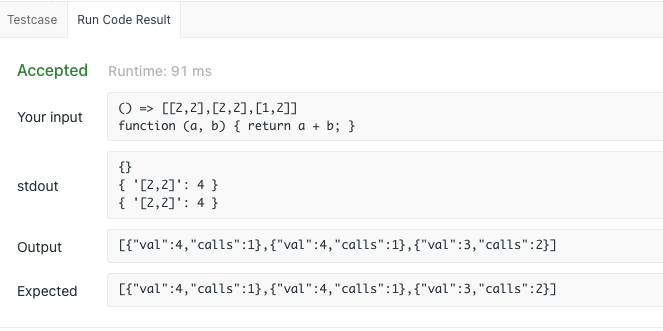
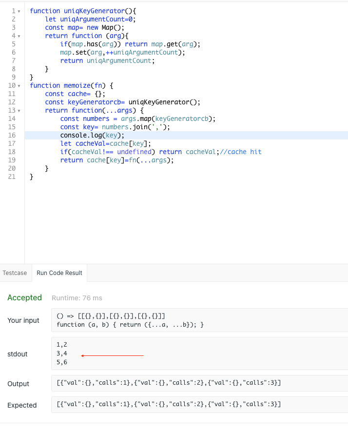

# Functional programming
- Functional programming is a programming paradigm that emphasizes the use of pure functions and immutable data.
- In functional programming, functions are treated as mathematical entities that produce output based solely on their input, without any side effects.
- This means that functional programs avoid changing state and mutable data, focusing instead on transforming data through the application of functions.

Functional programming promotes the following principles:

## **Pure Functions**
 >Pure functions produce the same output for the same input and have no side effects. They don't modify external state or variables, making them easier to reason about and test.

## **Immutability**
 >Functional programming encourages the use of immutable data, where values cannot be modified after they are created. This eliminates the need for complex state management and helps prevent bugs caused by unintended mutations.

## **Higher-Order Functions (HOF)**
 >They allow functions to be manipulated and composed, leading to more modular and reusable code.

## **Recursion**
> Functional programming favors recursion over iterative loops. Instead of changing state in a loop, recursive functions call themselves with updated parameters until a base case is reached.
---
Alternative programming paradigms to functional programming include:

## **Procedural Programming**
 >Procedural programming focuses on using procedures or subroutines to organize code and perform actions step by step. It relies heavily on mutable state and often uses global variables to share data between procedures.

## **Object-Oriented Programming (OOP)**
> OOP revolves around creating objects that encapsulate both data and behavior. It uses classes, objects, and inheritance to model real-world entities. OOP incorporates mutable state and allows methods to modify object state.

 ---

 # M E M O I Z A T I O N
>  - An important example of HOF
>  - Memoization only works correctly for pure functions.(We try to make functions pure when possible)


## Memoization Use-cases in Web Development

### Caching Website Files
A large website often consists of many JavaScript files which are dynamically downloaded when a user visits different pages. A pattern is sometimes employed where the filename is based on a hash of the file's content. That way, when the web browser requests a filename that was already requested before, it can load the file locally from disk rather than have to download it again.

### React Components
React is a highly popular library for building user interfaces, especially for single-page applications. One of its core principles is the idea of breaking down your application into separate components. Each of these components is responsible for rendering a distinct part of the app's HTML.

For example you might have a component like this:

```jsx
const TitleComponent = (props) => {
  return <h1>{props.title}</h1>;
};
```
The above function will get called every time the parent component renders, even if title was not changed. Performance can be improved by calling React.memo on it, avoiding unnecessary renders.

```jsx
const TitleComponent = React.memo((props) => {
  return <h1>{props.title}</h1>;
});
```
Now, TitleComponent will only re-render if the title has changed, thereby improving the performance of the application.

## Caching API Calls
Suppose you had a function that sends a network request to an API to access key-value pairs in a database.

```js
async function getValue(key) {
  // database request logic
}
const getValueMemoized = memoize(getValue);
```

Now getValueMemoized will only make a network request once for each key, potentially greatly improving performance. Something to note is that since getValue is async it will return a Promise rather than an actual value. For this use-case, this actually ideal because it will still only make a network request once even if it was called twice before the first request returned a value.

A potential downside of memoizing network requests is the risk of data staleness. If the value associated with a particular key in the database changes, the memoized function may still return the old cached result, leaving the user unaware of any updates.

### A few ways to handle this:

1. Always send a request to the API asking if the value was changed.
1. Use a WebSocket to subscribe to changes in the values in the database.
1. Give the value Time Until Expiration so that at least the user won't see data that's TOO outdated.

---

---
## Possible solutions
## 1. Create hash key using JSON.stringify(args) ❌
```js
function memoize(fn) {
    const cache= {};// notice that we cannot make this inside below function
    return function(...args) {
        const key= JSON.stringify(args);
        // above wont work as args can be objects , not two empty objects are ===
        console.log(key);
        let cacheVal=cache[key];
        if(cacheVal!== undefined) return cacheVal;//cache hit
        return cache[key]=fn(...args);
    }
}

```

In above example  It may seem like there should only be 1 call to fn() because of cache-hits, however none of those objects are === to each other.

---
---
---

## 2. Using [map](./map.md)(comparing via ===) and assigning unique keys to arguments relative to each other✅
```js
function uniqKeyGenerator(){
    let uniqArgumentCount=0;
    const map= new Map();
    return function (arg){
        if(map.has(arg)) return map.get(arg);
        map.set(arg,++uniqArgumentCount);
        return uniqArgumentCount;
    }
}
function memoize(fn) {
    const cache= {};
    const keyGeneratorcb= uniqKeyGenerator();
    return function(...args) {
        const numbers = args.map(keyGeneratorcb);
        const key= numbers.join(',');
        let cacheVal=cache[key];
        if(cacheVal!== undefined) return cacheVal;//cache hit
        return cache[key]=fn(...args);
    }
}
```



[Given a , b mapping each unquie pair to unique value ]( https://stackoverflow.com/questions/919612/mapping-two-integers-to-one-in-a-unique-and-deterministic-way)
