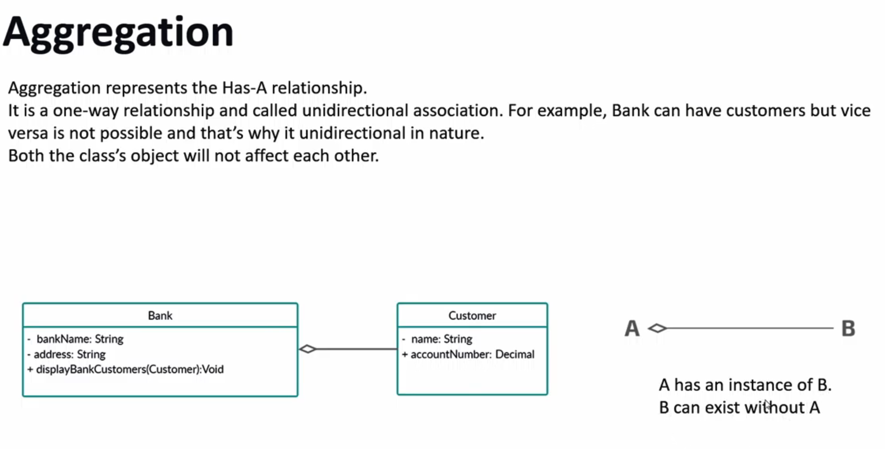

# MAKING UML DIAGRAMS

---
---

# APPLICATION OF CONCEPT

# OOPS IN C++
## Access specifiers in c++

## Inheritance Types and visibelity Modes in C+++

## Static keyword in c++
__Static "Member" variables__ must be initialsised outside the class !

## Initilisation at the time of declaration

## Enums and Enum classes in C++
__"Collection of related constants"__

## METHOD OVERLOADING / OVERRIDING / HIDING
# METHOD OVERLOADING

# METHOD OVERRIDING

# METHOD HIDING

# VIRTUAL FUNCTIONS

# ABSTRACT CLASSES IN C++

