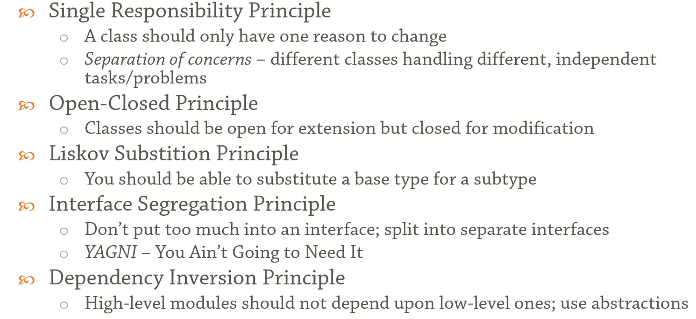

# SOLID DESIGN PRINCIPLES

# 1. SINGLE RESPONSIBELITY PRINCIPLE (Seperation of concerns)
> # A class should have only one reason to change
```cpp
struct Journal{
  string title;
  vector<string> entries;
    // NOTE: the "explicit" keyword in C++ constructors ensures that the constructor is not used implicitly for type conversions, and instead, you need to explicitly convert the object before using it in certain situations.
  explicit Journal(const string& title)
    : title{title}{}
    void add(const string& entry){
        static int count=1;
        entries.push_back(to_string(count++)+" : "+entry);
    }
  // persistence is a separate concern==> below function is a violation
  void save(const string& filename);
};

struct PersistenceManager {
  static void save(const Journal& j, const string& filename)
  {
    ofstream ofs(filename);
      for (auto& s : j.entries){
          ofs << s << endl;
          cout<<s<<endl;
      }
  }
};

int main(){
  Journal journal{"Dear Diary"};
  journal.add("I ate a bug");
  journal.add("I cried today");
  //journal.save("diary.txt");=> violation of Seperation of concerns
  PersistenceManager pm;
  pm.save(journal, "diary.txt");
}
```
<br/>
<br/>
<br/>

# 2. OPEN CLOSED PRINCIPLE
># - Class should be open to extension and closed for modification
```cpp

enum class Color { red, green, blue };
enum class Size { small, medium, large };

struct Product{
  string name;
  Color color;
  Size size;
};
// THIS TYPE OF IMPLEMENTATION IS WRONG AS IT CAUSES A CARTERIIAN EXPLOSION AND DOESNT SCAPE
struct ProductFilter {//=> violation of Open closed principle as every new filtering criteria would lead to
    // modification (addition of a new function) below
  typedef vector<Product*> Items;

  Items by_color(Items items, const Color color){
    Items result;
    for (auto& i : items)
      if (i->color == color)
        result.push_back(i);
    return result;
  }

  Items by_size(Items items, const Size size){
    Items result;
    for (auto& i : items)
      if (i->size == size)
        result.push_back(i);
    return result;
  }

  Items by_size_and_color(Items items, const Size size, const Color color){
    Items result;
    for (auto& i : items)
      if (i->size == size && i->color == color)
        result.push_back(i);
    return result;
  }
};

int main(){
  Product apple{"Apple", Color::green, Size::small};
  Product tree{"Tree", Color::green, Size::large};
  Product house{"House", Color::blue, Size::large};

  const vector<Product*> all { &apple, &tree, &house };
    ProductFilter pf;
    auto green_things=pf.by_color(all, Color::green);
    for(auto& item: green_things)
        cout<<item->name<<endl;

  return 0;
}
```
## CODE IN ACCORDANCE WITH OPEN CLOSED PRINCIPLE AND ALSO USING SPECIFICATION PATTERNS (Enterprise pattern)
```cpp
enum class Color { red, green, blue };
enum class Size { small, medium, large };

struct Product{
  string name;
  Color color;
  Size size;
};

template <typename T> struct Specification {
    virtual bool is_satisfied(T* item)=0;
};

template <typename T> struct AndSpecification:Specification<T> {
    Specification<T>& first;
    Specification<T>& second;
    AndSpecification( Specification<T>& first,
                     Specification<T>& second):first(first), second(second){}
    bool is_satisfied(T* item) {
        return first.is_satisfied(item) && second.is_satisfied(item);
    }
};

template <typename T> struct OrSpecification:Specification<T> {
    Specification<T>& first;
    Specification<T>& second;
    OrSpecification( Specification<T>& first,
                     Specification<T>& second):first(first), second(second){}
    bool is_satisfied(T* item) {
        return first.is_satisfied(item) || second.is_satisfied(item);
    }
};


struct ColorSpecification: Specification<Product> {
    Color color;
    ColorSpecification(Color color): color(color){};
    bool is_satisfied(Product* item) override {
        return item->color==color;
    }
};

struct SizeSpecification: Specification<Product> {
    Size size;
    SizeSpecification(Size size): size(size){};
    bool is_satisfied(Product* item) override {
        return item->size==size;
    }
};

template <typename T> struct Filter {
    virtual vector<T*> filter(vector<T*> items,Specification<T> & spec)=0;
};

struct BetterFilter :Filter<Product> {
    vector<Product*> filter(vector<Product*> items,Specification<Product> & spec) override {
        vector<Product*> result;
        for(auto& item:items) {
            if(spec.is_satisfied(item))
                result.push_back(item);
        }
        return result;
    }
};
int main (){
    Product apple{"Apple", Color::green, Size::small};
     Product tree{"Tree", Color::green, Size::large};
     Product house{"House", Color::blue, Size::large};

     const vector<Product*> items { &apple, &tree, &house };
    ColorSpecification green(Color::green);
    SizeSpecification  large(Size::large);
    AndSpecification<Product> greenAndLarge(green,large);

     BetterFilter bf;
    for(auto& item:bf.filter(items, greenAndLarge)){
        cout<<item->name<<endl;
    }
    return 0;
}
```
<br/>
<br/>
<br/>

# 3. LISKOV SUBSTITUTION PRINCIPLE

># Substypes should be substitutable for base types. Subclass should extend the capabelity of parent class and not narrow it down
## for example any function that works for rectangles should also be valid for sqaures

```cpp
// Objects in a program should be replaceable with instances of their subtypes
// w/o altering the correctness of the program
class Rectangle{// has no pure virtual function so its neither an abstract class nor an interface
protected:
  int width, height;
public:
  Rectangle(const int width, const int height)
    : width{width}, height{height} { }

  int get_width() const { return width; }
  virtual void set_width(const int width) { this->width = width; }
  int get_height() const { return height; }
  virtual void set_height(const int height) { this->height = height; }

  int area() const { return width * height; }
};
// NOTE :If you want to enforce that a derived class must override a virtual function, you can make the virtual function a pure virtual function by using the = 0 syntax in its declaration. This makes the base class an abstract class, and any derived class must provide an implementation for the pure virtual function in order to be instantiated.
//=>An abstract class is created by defining at least one pure virtual function in the class.
//=>An interface can be achieved by using a class with all pure virtual functions and no member variables. An interface defines a contract or a set of methods that a class must implement, but it does not provide any implementation itself.
class Square : public Rectangle {
public:
  Square(int size): Rectangle(size,size) {}
  void set_width(const int width) override {
    this->width = height = width;
  }
  void set_height(const int height) override {
    this->height = width = height;
  }
};

void processRectanlge(Rectangle& r) {// => Function is giving faulty results as it violates LISKOV SUBSTITUTION PRINCIPLE
  int w = r.get_width();
  r.set_height(10);

  std::cout << "expected area = " << (w * 10)
    << ", got " << r.area() << std::endl;
}
// objects of a superclass should be replaceable with objects of its subclasses without affecting the correctness of the program.
int main()
{
  Rectangle r{ 5,5 };
    processRectanlge(r);

    Square s{ 5 };
    processRectanlge(s);// violation of LSP

  getchar();
  return 0;
}
// A resolution here would be removing the inheritance between Rectangle and Square and instead create separate classes for Rectangle and Square without any inheritance relationship.
```

<br/>
<br/>
<br/>

# 4. Interface segregation principle
> ## keep interfaces as small as possible so that implementors implement only what they need

```cpp

struct Document;

struct IMachine{ // => Violates Interface segregation principle
  virtual void print(Document& doc) = 0;
  virtual void fax(Document& doc) = 0;
  virtual void scan(Document& doc) = 0;
};

struct Scanner : IMachine{// implementor is forced to implement all functions
    // which it doesnt need in the first place
    void print(Document& doc) override;//
    void fax(Document& doc) override;
    void scan(Document& doc) override{
        cout<<"I do scan, but thats all i do"<<endl;
    }
};
//  => Resolution is creating smaller interfaces- segregation

struct IPrinter{
  virtual void print(Document& doc) = 0;
};

struct IScanner{
  virtual void scan(Document& doc) = 0;
};

struct Printer : IPrinter{
  void print(Document& doc) override;
};

struct BetterScanner : IScanner{
    void scan(Document& doc) override{
        cout<<"I do scan thats all i do"<<endl;
    }
};

struct BetterIMachine: IPrinter, IScanner{
    // Intercae with acts as and AND beteween interfaces
    //Multiple Inheritance
};

struct Machine : BetterIMachine{
  IPrinter& printer;
  IScanner& scanner;

  Machine(IPrinter& printer, IScanner& scanner)
    : printer{printer},
      scanner{scanner}
  {
  }

  void print(Document& doc) override {
    printer.print(doc);
  }
  void scan(Document& doc) override;
};

int main(){
    getchar();
    return 0;
}

// NOTE : Interface => all pure virtual functions
// NOTE : Abstract class => atleast one pure virtual function
// every interface is an abstract class

```
# 5. DEPENDECY INVERSION PRINCIPLE

>## High level modules should not depend of low level modules
>## both of them should depend on abstractions
and
> ## Abstractions should not depend on the details
> ## Details should depend upon abstractions

```cpp
// CODE VIOLATING DEPENDECY INVERSION PRINCIPLE
enum class Relationship {
  parent,
  child,
  sibling
};

struct Person {
  string name;
};

struct Relationships // low-level module
{
  vector<tuple<Person, Relationship, Person>> relations;

  void add_parent_and_child(const Person& parent, const Person& child){
    relations.push_back({parent, Relationship::parent, child});
    relations.push_back({child, Relationship::child, parent});
  }
};

struct Research // high-level module{
  Research(const Relationships& relationships)// we took a direct dependecy here over a low-level module
  {
    auto& relations = relationships.relations;// => Violates dependecy inversion principle as it
      // depends upon vector based implentation of a low level module
    for (auto&& [first, rel, second] : relations)
    {
      if (first.name == "John" && rel == Relationship::parent)
      {
        cout << "John has a child called " << second.name << endl;
      }
    }
  }
};

int main()
{
  Person parent{"John"};
  Person child1{"Chris"};
  Person child2{"Matt"};

  Relationships relationships;
  relationships.add_parent_and_child(parent, child1);
  relationships.add_parent_and_child(parent, child2);

  Research _(relationships);
  //John has a child called Chris
  //John has a child called Matt

  return 0;
}
```

<br/>
<br/>

## There are two ways to adhere to DIP here , first we must create an abstraction and then both HLM and LLM have a dependecy on that instead of depending on each other and other concept is moving a high level functionality to a low level module, and then expose it using a HLM,  for example below we make relationships a relationship browser
```cpp
// Implementation adhering to Dependecy Intervsion principle
enum class Relationship {
  parent,
  child,
  sibling
};

struct Person {
  string name;
};

struct RelationshipBrowser {
  virtual vector<Person> find_all_children_of(const string& name) = 0;
};

struct Relationships :RelationshipBrowser // low-level module
{
  vector<tuple<Person, Relationship, Person>> relations;

  void add_parent_and_child(const Person& parent, const Person& child){
    relations.push_back({parent, Relationship::parent, child});
    relations.push_back({child, Relationship::child, parent});
  }

  vector<Person> find_all_children_of(const string &name) override
  {
    vector<Person> result;
    for (auto&& [first, rel, second] : relations)
    {
      if (first.name == name && rel == Relationship::parent)
      {
        result.push_back(second);
      }
    }
    return result;
  }
};

struct Research // high-level module
{
  Research(RelationshipBrowser& browser)
  {
    for (auto& child : browser.find_all_children_of("John"))
    {
      cout << "John has a child called " << child.name << endl;
    }
  }

};

int main()
{
  Person parent{"John"};
  Person child1{"Chris"};
  Person child2{"Matt"};

  Relationships relationships;
  relationships.add_parent_and_child(parent, child1);
  relationships.add_parent_and_child(parent, child2);

  Research _(relationships);

  return 0;
}
```


## SUMMARY

