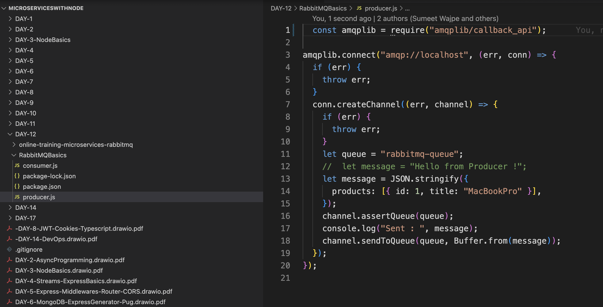

# Introduction to Event/Message Brokers

- AMQLPLIB - protocol for rabbitmq
- npm init -y
- brew install rabbitmq
- brew services start rabbitmq
- => Goto localhost:1562 for rabbitmq GUI username/password : guest

## Simple producer counsuner example for rabbitmq

nodemon producer.js , nodemon consumer.js
> Unless the consumer sends ACK message will continue to be enqueued

# The big picture
- npx create-react-app client, npm i cors
-

> ## We created our first npm pacakage , a middlware -isAuthenticated middleware that enabled each service to share authentication logic

# Intro to Docker and Kubernetes

 Suppose you are working on a web application that consists of multiple components, such as a front-end web server, a backend API server, and a database. You need to ensure that the application runs consistently across different environments, from development to production. Additionally, you want to streamline the deployment process and ensure easy scalability.

## **Solution using Docker**:

- ### Application Packaging: With Docker, you can package each component of your application into a separate container. The front-end, backend, and database can each be encapsulated within their own Docker container, including all the required dependencies and configurations.

- ### Consistency Across Environments: Docker containers provide consistency across different environments. You can develop and test your application locally on your development machine using Docker containers. Once you have verified that it works correctly, you can confidently move the same containers to other environments like staging and production without worrying about differences in underlying infrastructure or dependencies.

- ### Isolation and Dependency Management: Docker containers offer process-level isolation, ensuring that each component runs in its own isolated environment. This isolation prevents conflicts between different components or dependencies, allowing you to easily manage and update individual containers without affecting others.

- ### Streamlined Deployment: Docker simplifies the deployment process. You can create Docker images for each component, which include the application code, dependencies, and configurations. These images can be versioned, stored in a central registry, and easily deployed to any environment using a simple command. This eliminates the need for manual setup and configuration, reducing the chance of errors and saving deployment time.

- ### Scalability: Docker enables easy scalability of your application. You can leverage container orchestration tools like Docker Swarm or Kubernetes to manage a cluster of Docker hosts. These tools allow you to automatically scale your application by spinning up additional containers based on the demand, distributing the load across multiple hosts, and ensuring high availability.

- ### Collaboration and Continuous Integration/Deployment (CI/CD): Docker facilitates collaboration among team members. Developers can share Docker images, ensuring that everyone is working with the same application environment. Docker also integrates well with CI/CD pipelines, enabling automated testing, building, and deployment of containers, leading to faster delivery cycles and increased productivity.

## Docker offers several advantages over traditional virtual machines (VMs):

- Resource Efficiency: Docker containers share the host machine's OS kernel, which eliminates the need for running multiple OS instances like in VMs. This results in better resource utilization, as Docker containers are lightweight and require fewer system resources such as memory and disk space compared to VMs.

- Faster Startup and Deployment: Docker containers can be created and deployed much faster than VMs. They use a layered filesystem and can leverage pre-built container images, allowing for quick deployment and efficient utilization of system resources. In contrast, VMs require the setup and configuration of an entire virtualized environment, including the installation of an OS, which can be time-consuming.

- Isolation and Security: While VMs provide strong isolation by running separate OS instances, Docker containers offer process-level isolation. Containers are sandboxed environments that keep applications and their dependencies isolated from each other. This isolation provides security benefits by reducing the risk of malicious activities affecting the host or other containers.

- Portability: Docker containers are highly portable. They encapsulate applications and their dependencies into self-contained units called container images. These images can be run on any host machine with Docker installed, regardless of the underlying infrastructure. VMs, while portable to some extent, may require additional configuration or conversion steps when moving between different hypervisors or cloud providers.

- Scalability and Orchestration: Docker has a rich ecosystem of tools like Docker Swarm and Kubernetes that facilitate container orchestration and scaling. These tools allow you to manage clusters of Docker hosts, automatically scale containers based on demand, distribute workloads, and ensure high availability. VMs typically use different management and orchestration tools designed specifically for virtualized environments.

- Ecosystem and Community Support: Docker has gained significant popularity and has a large and active community. This means that there are abundant pre-built Docker images available in public repositories for a wide range of applications and software stacks. Additionally, Docker provides a rich set of tools and features that enhance the containerization and deployment workflow.

> Install docker give us two things
> - The docker daemon
> - The docker Client(Dekstop)

> Docker Images are like templates that are used by docker containers for example to run Node.js in our containers we need to install the Node Docker Image

## Getting started with Dockerisation

- Download docker (to run, virtualisation must be enabled in the machine)
-  Go to docker hub(Online Repo for docker image) and find the images you want - for example Node.js

- Test installation

## Creating a sample docker file
- A docker file has no extension

- Reproducible builds: It defines the steps to build a Docker image consistently across different environments.

- Automation and efficiency: Dockerfiles automate the image creation process, reducing manual effort and enabling CI/CD pipelines.

- Configuration and customization: Dockerfiles allow customizing the container environment, specifying dependencies, settings, and commands.

- Version control integration: Dockerfiles can be version-controlled alongside code, ensuring traceability and easy collaboration.

- Portability: Dockerfiles enable creating self-contained and portable Docker images for consistent deployment across environments.

## Dockerising Courses Service

---
> ## Above npm install installs all packages but for running Mongodb we would need an image, similarly we would need an image for rabbitMQ.

> But FROM cannot be used multiple times **DOCKER COMPOSE** file comes to our rescue here

# Docker file for courses

> docker build -t onlinetrainingapp-withdocker/courses
> ## Run : docker compose up

# Services
> Mongodb and rabbitmq are running in their own containers - now for them to communicate we require services

- there are two types of services , the node service and the cluster IP service
