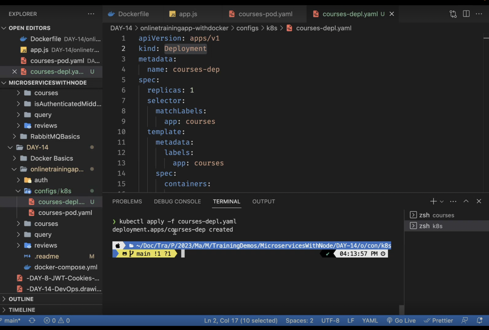

# Dockerising every service

1. Create DockerFile and DockerIgnore for each service

similary for query only port would become 3002, and for auth 3003
2.

 # KUBERNETES
 > Kubernetes is an open-source container orchestration platform that automates the deployment, scaling, and management of containerized application

 > ## Kubernetes is esstential to having communicaton between containers

 Why use Kubernetes with Docker?

Using Kubernetes with Docker provides several benefits:

- Container Management: Kubernetes acts as an orchestrator for Docker containers, allowing you to easily manage and deploy them across a cluster of machines. Kubernetes provides a unified interface to manage containers, ensuring consistent deployment, scaling, and monitoring of your applications.

- Scalability: Kubernetes enables you to scale your applications effortlessly. It can automatically scale the number of containers based on the demand, ensuring your applications can handle increased traffic or workload. Kubernetes also provides features like horizontal scaling, which allows you to add or remove containers dynamically to match the desired performance and resource requirements.

- Service Discovery and Load Balancing: Kubernetes offers built-in service discovery and load balancing features. It automatically assigns a unique IP address and DNS name to each container, making it easy to communicate with other containers within the cluster. Load balancing ensures that traffic is distributed evenly across containers, optimizing resource utilization and providing high availability.

- Fault Tolerance and Self-healing: Kubernetes continuously monitors the health of containers and automatically restarts or replaces failed containers. It ensures that your applications are highly available and resilient to failures, reducing downtime and providing a robust environment for running containerized applications.

- Resource Optimization: Kubernetes allows you to define resource requirements and constraints for containers, ensuring efficient resource allocation. It optimizes resource utilization by automatically scheduling containers on available nodes and adjusting resource allocation based on demand.

- Rolling Updates and Rollbacks: Kubernetes supports rolling updates, which allow you to update your applications without downtime. It gradually replaces older containers with new versions, ensuring a smooth transition. In case of issues, Kubernetes also enables easy rollbacks to a previous stable version of the application.

Overall, Kubernetes complements Docker by providing powerful features for managing containerized applications at scale. It simplifies the deployment, scaling, and management of Docker containers, making it easier to build and operate resilient and scalable applications in a containerized environment.

# Creating Kubernetes Config File

# Creating courses Deployment

