## REVISION
 1. <font size=5> **Docker Image** </font>:
  a lightweight, standalone, and executable package that includes everything needed to run an application. It contains the application's code, runtime, system tools, libraries, and dependencies. Docker images are built using a <font size=5> **Dockerfile** </font> and can be shared, stored, and deployed across different environments.

 2. <font size=5> **Docker File** </font>
A Dockerfile is a text file that contains a set of instructions for building a Docker image. It specifies the base image, adds dependencies, configures the environment, copies files, and defines runtime commands. Dockerfiles use a specific syntax and a set of instructions provided by Docker. Here's an example of a Dockerfile for a simple Python application:

Dockerfile
```
# Use the official Python base image
FROM python:3.9

# Set the working directory in the container
WORKDIR /app

# Copy the requirements file and install dependencies
COPY requirements.txt .
RUN pip install --no-cache-dir -r requirements.txt

# Copy the application code into the container
COPY . .

# Specify the command to run the application
CMD ["python", "app.py"]
```
> ## docker build -t <image_name>:<tag> <path_to_dockerfile> : CREATES DOCKER IMAGE
> ##  docker run -d -p 8000:8000 myapp:latest : CREATES A CONTAINER(Running instance of an image) FROM IMAGE
---<br/>
<br/>
> ### The Dockerfile serves as a blueprint for creating a Docker image that encapsulates your application and its dependencies. Running a Dockerfile allows you to build an image with the required software, configurations, and dependencies in a consistent and reproducible manner. By running the Dockerfile, you create an image that can be used to run containers containing your application
> ### A Docker image is a template or blueprint for creating containers, while a Docker container is a running instance of an image that encapsulates the application and its dependencies. Images are used for creating containers, and each container derived from an image is an isolated and runnable environment.
<br/>

3. <font size=5> **Docker Compose** </font> Docker Compose is a tool used for defining and managing multi-container Docker applications. It allows you to define a multi-service application setup using a YAML file called docker-compose.yml. With Docker Compose, you can specify the configuration of services, network connections, volumes, and dependencies between containers, making it easier to deploy and manage complex applications.
> ## docker compose up [OPTIONS] [SERVICE...]: Builds and image and gets the container running

4. <font size=5> **Docker Containers** </font> Containers are isolated runtime environments created from Docker images. They encapsulate applications and their dependencies, ensuring consistency across different environments. Containers provide process isolation, resource allocation, and portability, allowing applications to run consistently across different systems. Containers are created and managed by Docker.

5. <font size=5> **Kubernetes (K8s)** </font>Kubernetes complements Docker by providing powerful features for managing containerized applications at scale. It simplifies the deployment, scaling, and management of Docker containers, making it easier to build and operate resilient and scalable applications in a containerized environment.
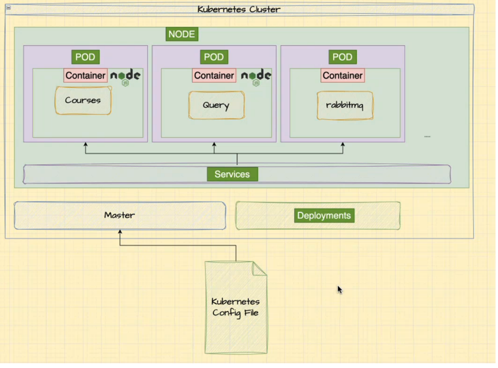
> - Kubernetes creates cluster
> - Cluster is a collecion of nodes
> - Node a Virtual or physical machine
> - Pod is a container of containers that are scheduled together on the same host and share the same networking and storage resources. Pods are the smallest executing blocks in Kubernetes deployments
> - ## Kubernetes runs your workload by placing containers into pods to run on Nodes
<br/>
Pods are not directly created from Docker images. Instead, they are created using Kubernetes YAML configuration files, which define the desired state of the pod, including the Docker image to use.

To create a pod from a Docker image, you need to follow these steps:

- Create a YAML file: Create a YAML configuration file that describes the pod's desired state. This file typically includes the pod's metadata, specification, and container details.

- Specify the Docker image: In the YAML file, you specify the Docker image to use for the container(s) within the pod. You provide the image name, version (tag), and any necessary environment variables or command settings.

- Define the pod specification: Within the YAML file, you define the specifications for the pod, including the container(s) to run, resource requirements, networking settings, and other configurations. You can also specify port mappings, volume mounts, and other settings specific to your application's needs.

- Apply the configuration: Use the kubectl apply command to apply the YAML configuration file to your Kubernetes cluster. This command instructs Kubernetes to create the pod based on the specified configuration.

- Kubernetes creates the pod: Upon receiving the YAML file, Kubernetes creates the pod by pulling the specified Docker image from a container registry, creating the necessary container(s) based on the image, and scheduling the pod on a suitable node in the cluster.

It's important to note that while a pod can contain one or more containers, it is the unit of scheduling in Kubernetes. Thus, multiple containers within a pod share the same resources, such as networking namespace and storage, and are co-located on the same node.

Overall, pods are created in Kubernetes based on the specifications provided in the YAML configuration file, which includes specifying the Docker image to use for the container(s) within the pod. Kubernetes takes care of pulling the image, creating the container(s), and managing the lifecycle of the pod within the cluster.

6. <font size=5> **Deployment** </font> monitors a collection of pods and restarts them when they fail/update/rolled back

> ## In practical cases we dont create kubernetes pods(ex courses-pod.yaml) we create kubernetes deployments .
- Replication and Scaling: Deployments provide an abstraction layer that manages the replication and scaling of pods. By specifying the desired number of replicas in a deployment, Kubernetes ensures that the specified number of pods is running at all times. Deployments simplify the process of scaling up or down the number of replicas based on demand.

- Rolling Updates and Rollbacks: Deployments offer rolling updates, allowing you to perform updates to your application without causing downtime. They gradually update pods to minimize service interruptions. If an update introduces issues, deployments support easy rollbacks to a previous known state, ensuring application stability.

- Self-Healing and High Availability: Deployments leverage ReplicaSets, which monitor the health of pods and automatically create new replicas if existing pods fail. This self-healing capability helps ensure the availability and reliability of your application.

- Declarative Management: Deployments provide a declarative way to manage your application's desired state. You define the desired configuration in the deployment manifest, and Kubernetes handles the orchestration to achieve and maintain that state. This simplifies application management and reduces the need for manual intervention.

However, there are cases where creating pods directly can be beneficial. Some scenarios include:

- Single-Container Applications: If you have a simple application that consists of a single container, creating a deployment might be unnecessary. In such cases, creating a single pod directly can be a simpler approach.

- Specialized Requirements: Certain use cases may require specific pod configurations or constraints that are better managed at the pod level. For example, you may need to interact with the underlying host's hardware directly or require specific scheduling constraints that cannot be achieved through deployments alone.

- Debugging and Testing: When troubleshooting or debugging, it can be useful to create pods directly to have more direct control and visibility over individual containers and their behavior.
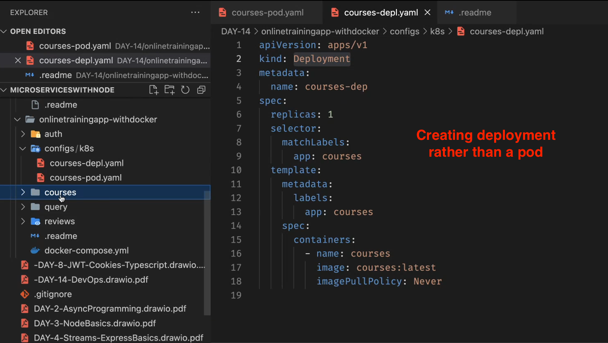
<br/>
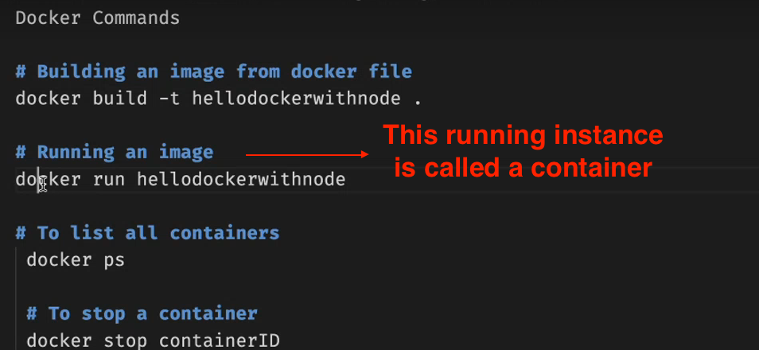
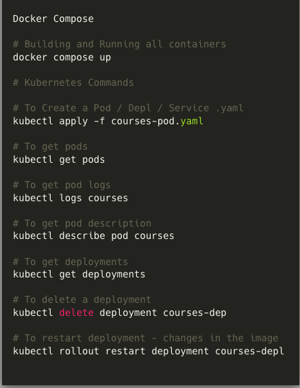

> ## For each of our microservice we will have a seperate deployment to be created

<br/>
<br/>
<br/>
<br/>
<br/>

# Understanding deployments

- When we are creating a deployment (YAML) , we are internally creating a pod that runs that particualr service , we would even be creating a deployment for our client along with all our services
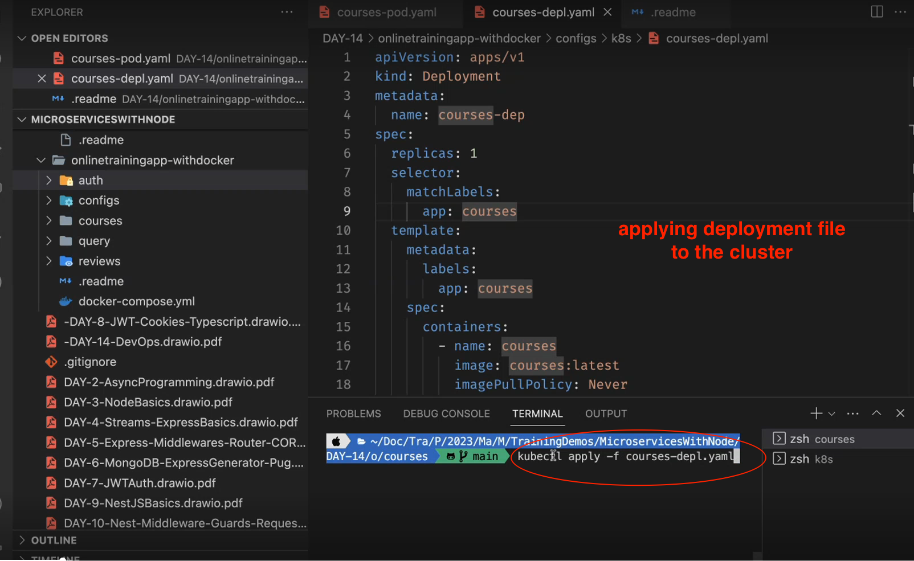
- When there is some change in codebase
    1. Build a new image/update with updated version/:latest ex
    > docker build -t courses:0.0.2<br/>
    OR<br/>
    > docker build -t:latest.
    2. Update image name in courses.depl.yaml
    3. Apply the deployment again
    > ~~kubectl apply -f courses-depl.yaml~~<br/>

    > kubectl rollout restart deployment courses-depl

# Understanding Services

> Once our microservices are containerised , we cannot directly use our ports , one pod cannot directly communicate with other pod , here is where **services** come in,
- they expose pods to each other or the outiside world
- They expose microservice(pod) using a known name at a port number

Hence there are different types of services
1. Node port service<br/>
    expose the microservice to outside world(dev only)
    > There can only be one Nodeport service per pod.
2. Cluster Ip Service<br/>
    > InterNode Communication
3. Load Balancer<br/>
    > Exposing to the client
# NODEPORT SERVICE
  We can have service to created in deployment file as well but just to understand we are creating it seperate

  - Nodeport service exposes a port to us which we can use
  > kubectl apply -f courses-srv.yaml
  <br/>

  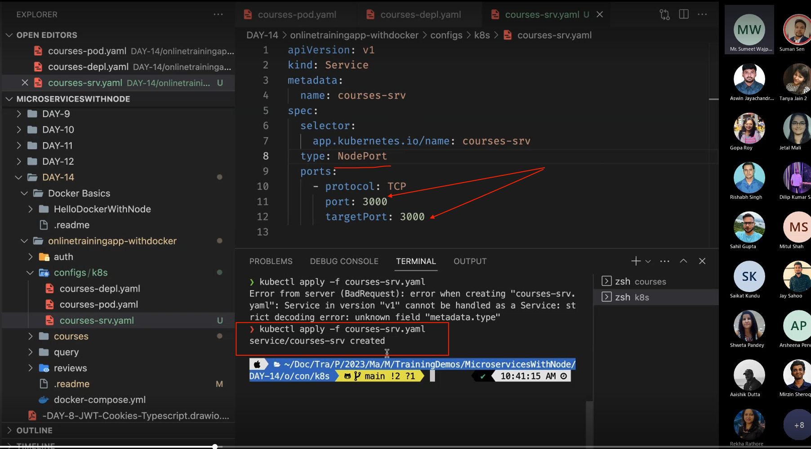
  - > kubectl get services
  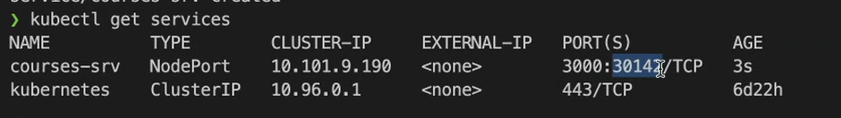
  - Now we can use port 30142 to communicate with our containerised service
  - > kubectl get deployments <br/>
    > kuberctl get pods <br/>
    > kubectl logs [__POD NAME__]

<br/>


# Cluster IP Service
- Makes the service reachable , wiithin the cluster
- Used by services to communicate within each other
- One Cluster Ip service -per pod
- each cluster Ip service has a frienly name
- We are going to create cluster IP service along with the deployment
- > kubectl delete deployment <br/>
- > kubectl get deployments <br/>
- > kubectl get pods <br/>
- > kubectl delete pod courses
- > kubectl get services
- > kubectl delete service courses-srv
- > kubectl get services <br/>

    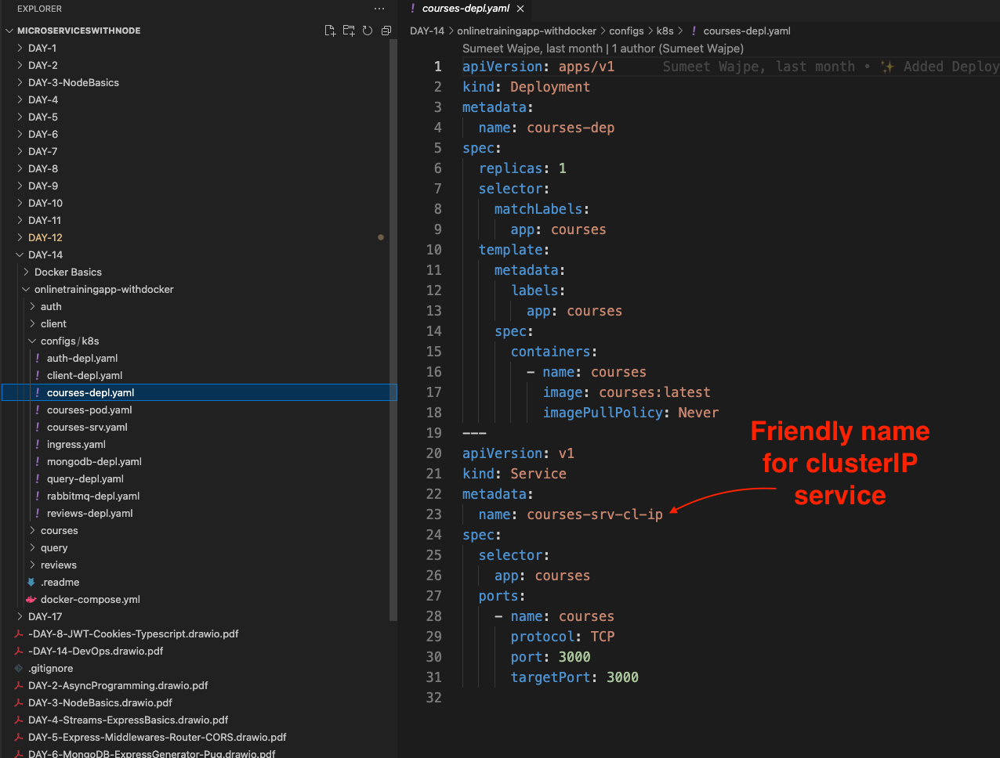
    (type is Cluster IP by default) <br/>
- > kubectl apply -f courses-deply.yaml <br/>
- __We__ cannot use this clusterIp Service from outside world, its used for inter-sevice communications exclisively
-  We create clusterIP service for each service similarly
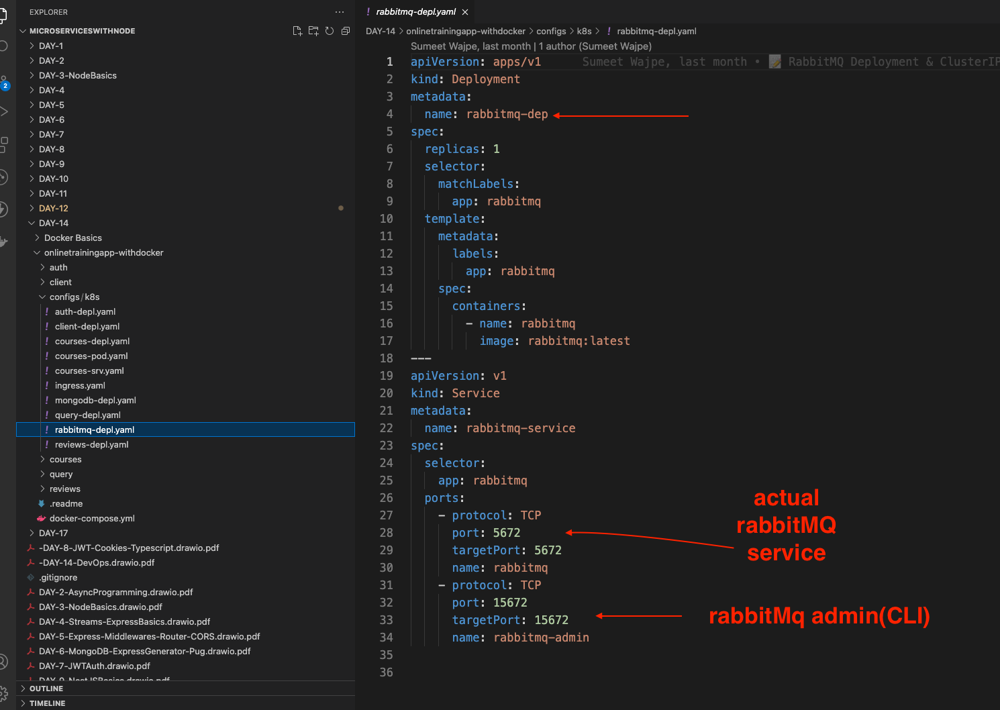

- > kubectl apply -f rabbitmq-depl.yaml
- > kubectl get services
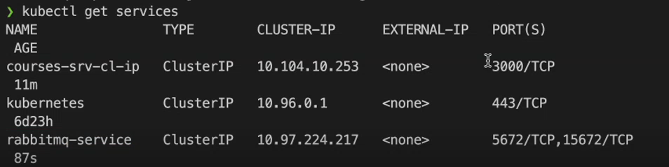 <br/>

Now we can communicate to rabbitmq from courses via its ClusterIP service
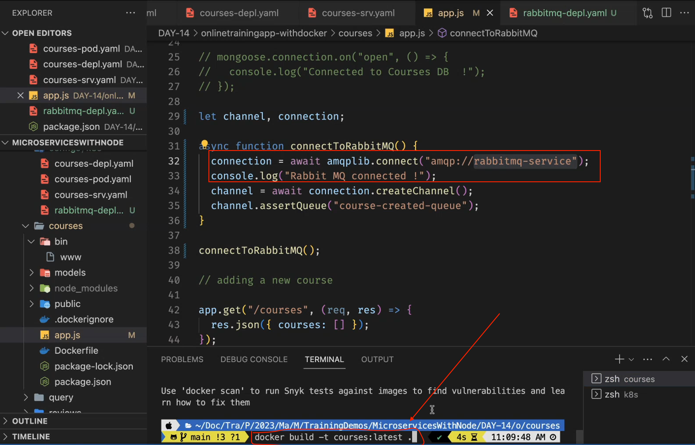
Similary we will be creatiing a ClusterIp service for mongodb
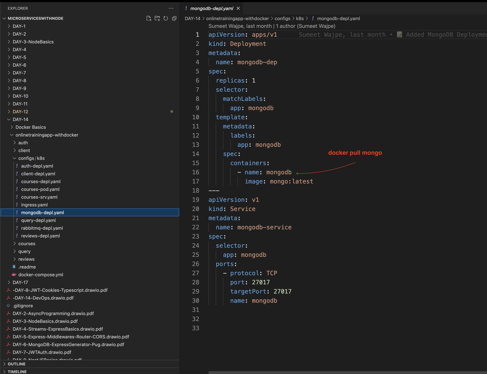
(Please make sure imagename matches with docker hub)

> ## kubectl rollout restart deployment courses-dep
> ## kubectl apply -f mongodb-depl.yaml


---
docker build -t courses:latest <br/>
kubectl rollout restart deployment courses-dep <br/>
kubectl get deployments
kubectl get pods
kubectl logs [__POD NAME__]
__CREATING THE SERVICE__<br/>
_Created the courses-srv.yaml_ <br/>
kubectl delete service courses-srv <br/>
kubectl apply -f courses-srv.yaml <br/>
kubectl get services <br/>
