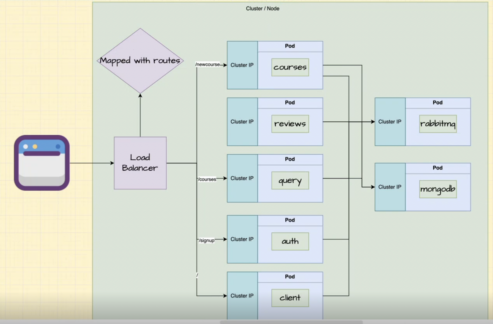
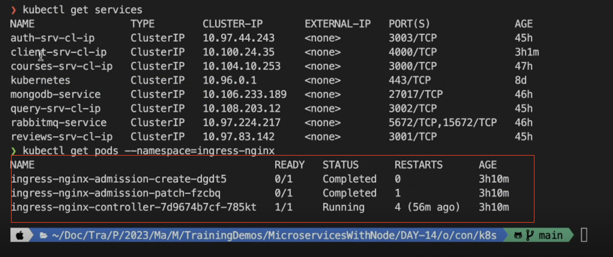
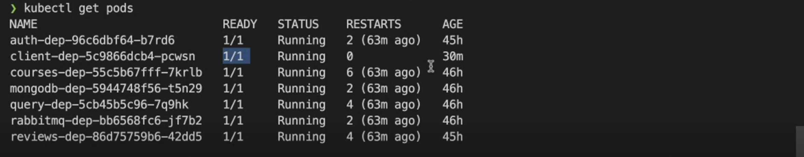
## Now our clinet is deployed and  load balancer(service we use to expose things to the outside world ) as a service is also running but it does not know what needs to be done we are going to have to map witht the routes

- we have created kind: service and kind: deployment now we will have to create kind : ingreess and we need to provide it RULES
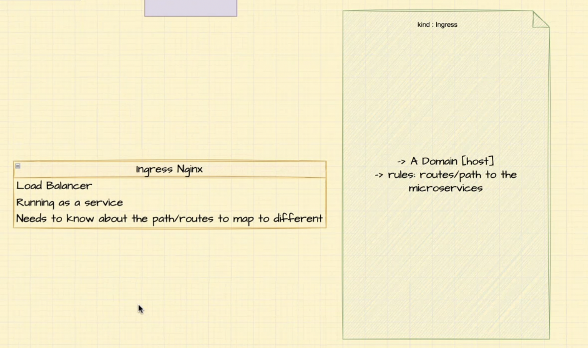
- With ingress nginx controller you cannot have the same route with different http verbs, ngix only takes into account the URL not the verb
- 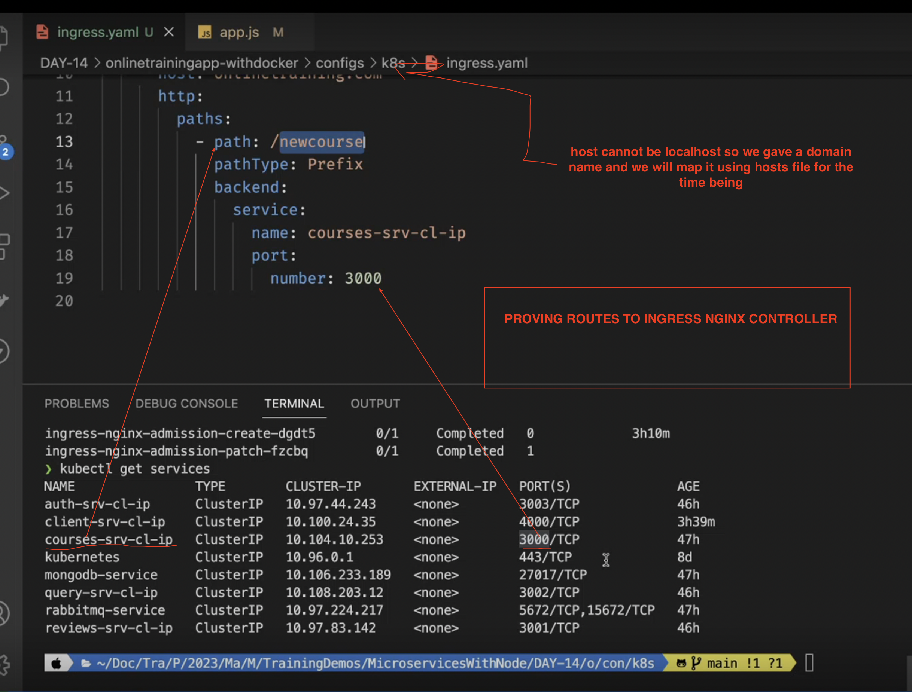
- 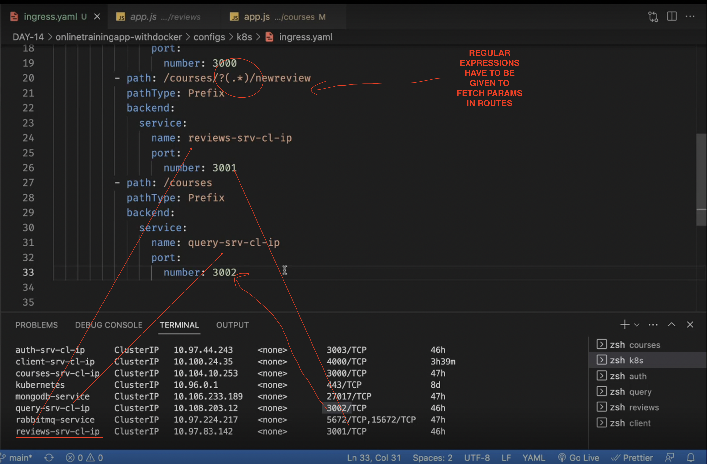
- 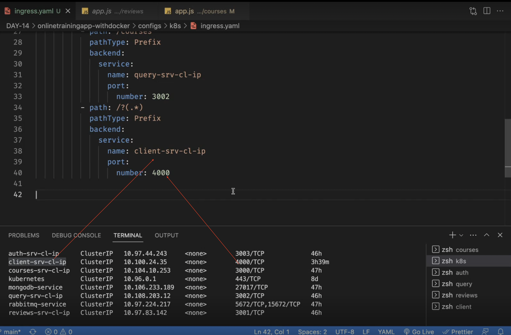

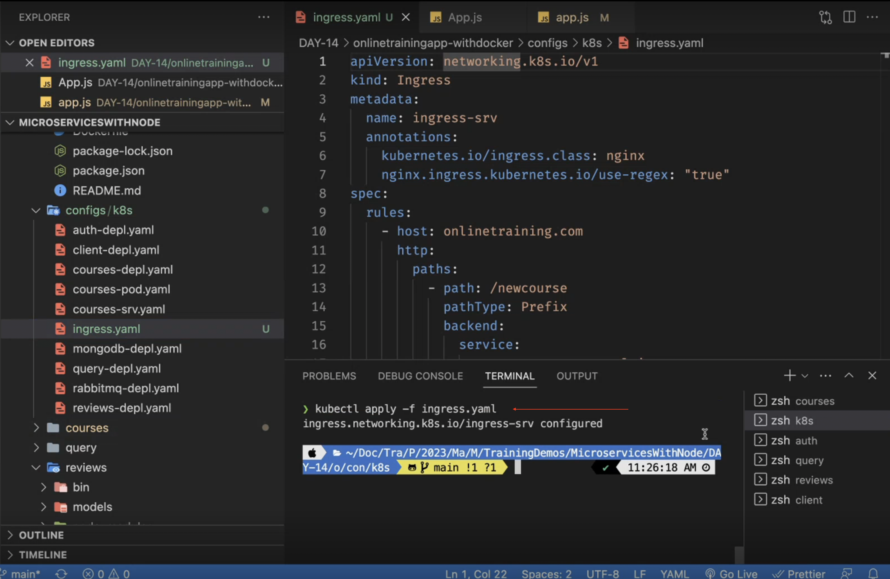
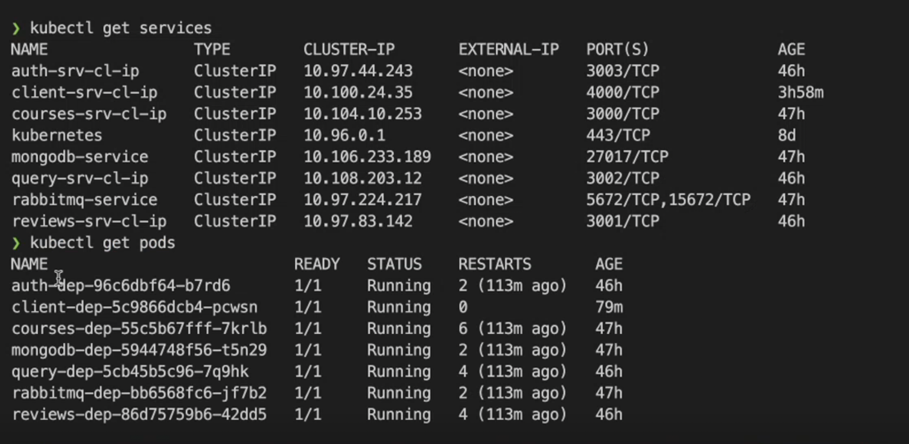

#
- DOCKER runs server at port 80
- 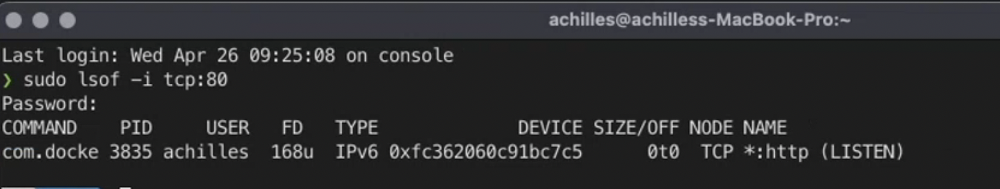

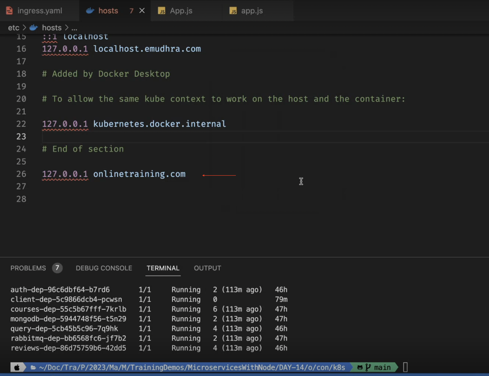
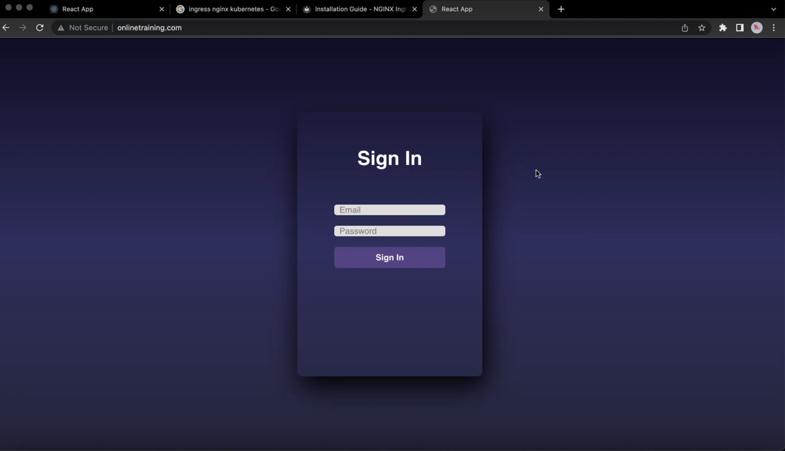

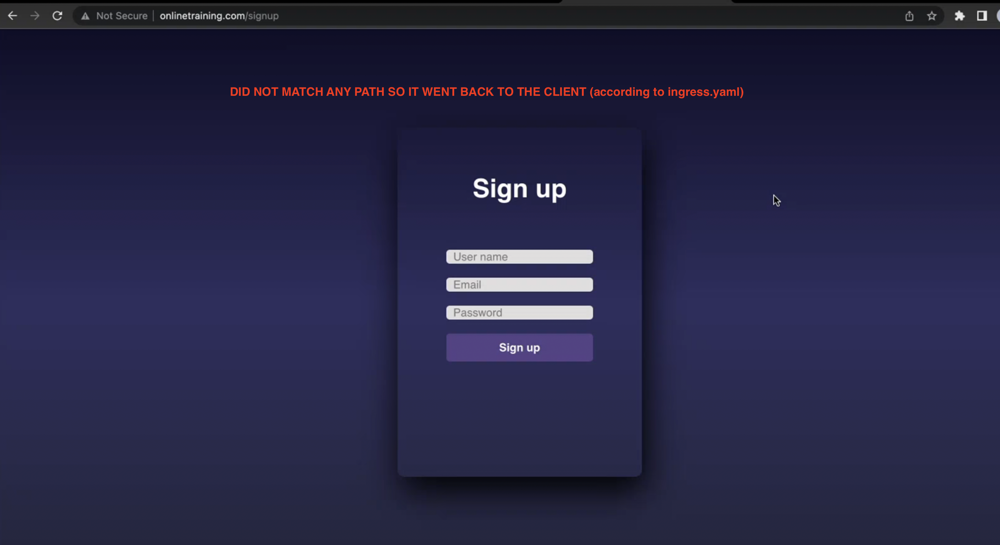
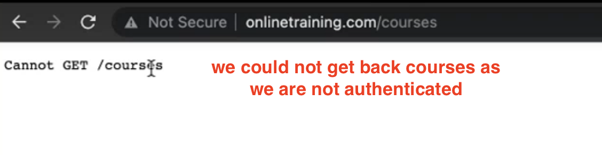
