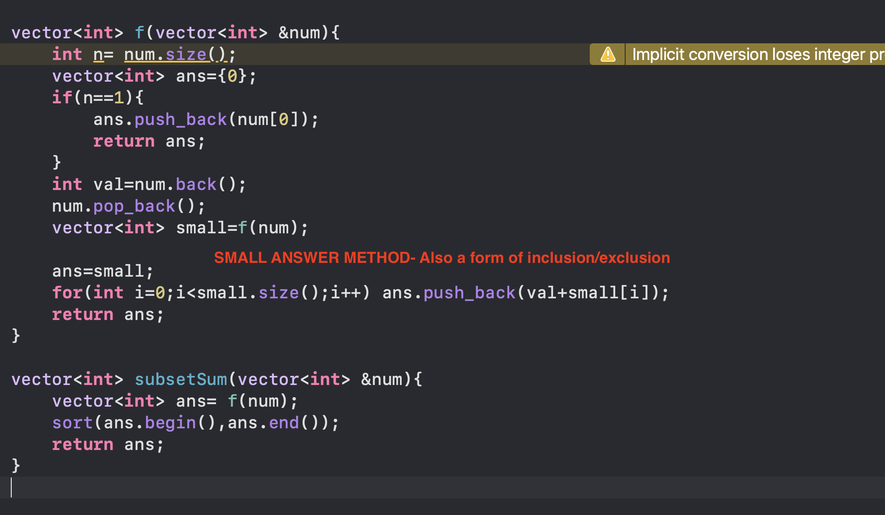
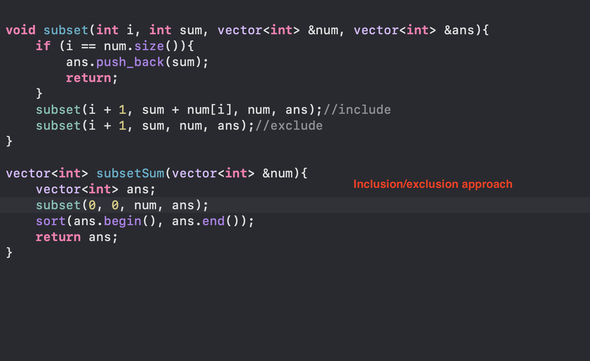
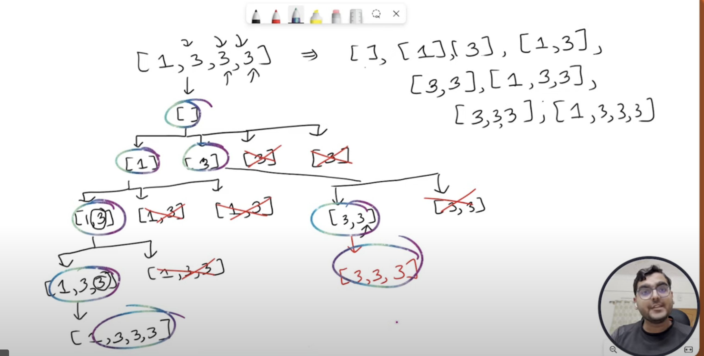
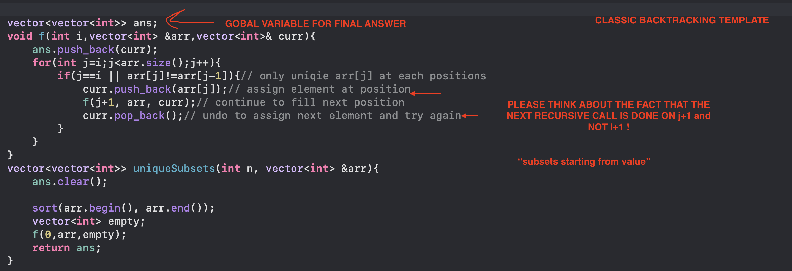
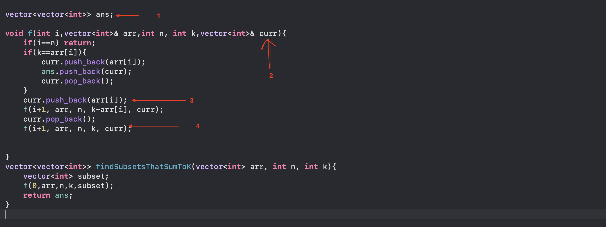
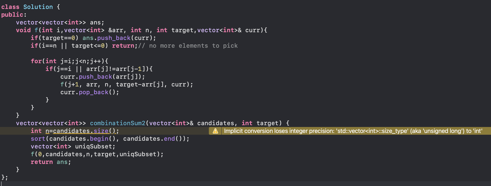
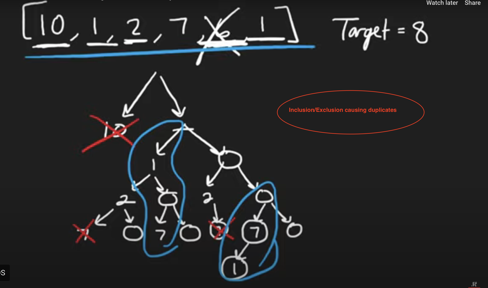
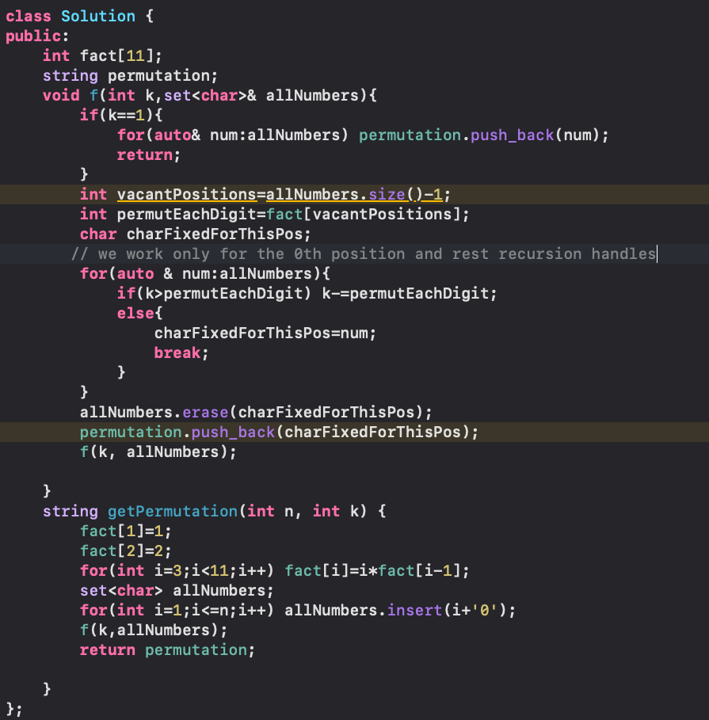
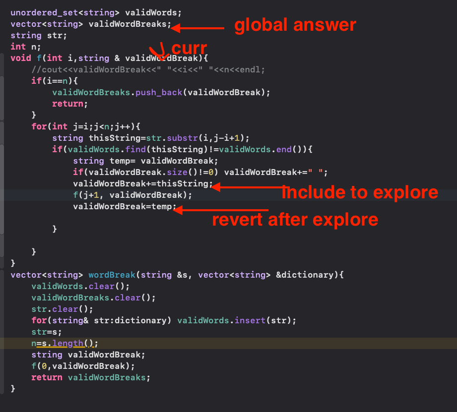
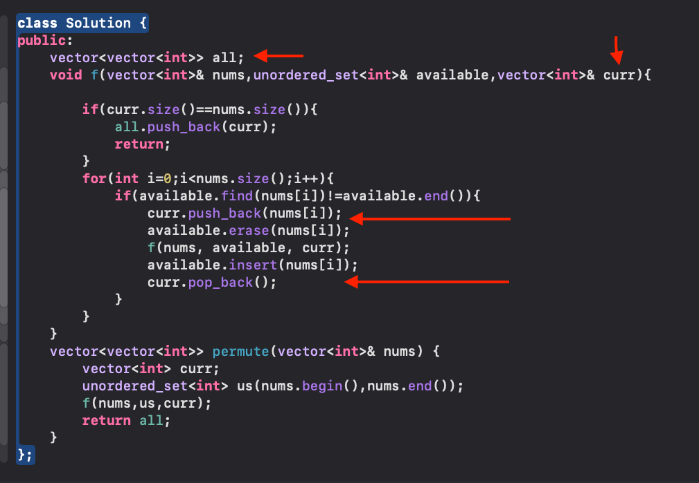

# RECURSION
## RETURN ALL SUBSET SUMS

## RETURN ALL UNIQUE SUBSETS

#### Please notice that backtracking always has this curr variable which roams in our recursion and is a represntation of all answerrs we are forming
## FIND ALL SUBSETS WHICH SUM TO K

## FIND ALL UNIQUE SUBSETS WHICH SUM TO K

> #### Each recusrive call picks subsets "starting from"

## FIND ALL PALINDROME PARTITIONINGS

## FIND THE KTH PERMUTATION SEQUENCE

# BACKTRACKING

## BREAK SENTENCE INTO dictionary WORDS (WORD BREAK-2)

## RETURN ALL POSSIBLE PERMUTATIONS

# N-QUEENS
# SUDOKU SOLVER
# RAT IN A MAZE ALL PATHS
# M -COLORING PROBLEM
