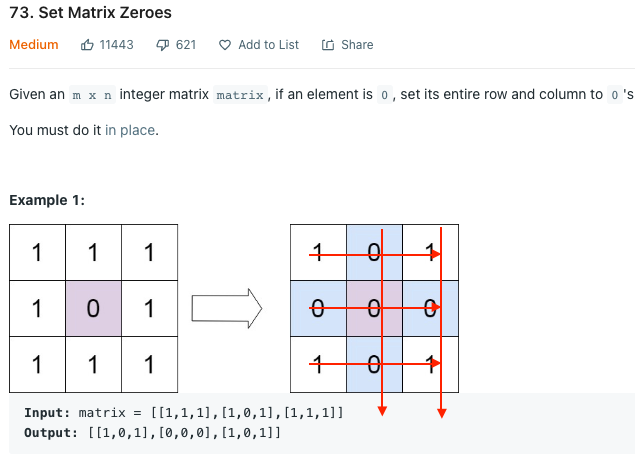
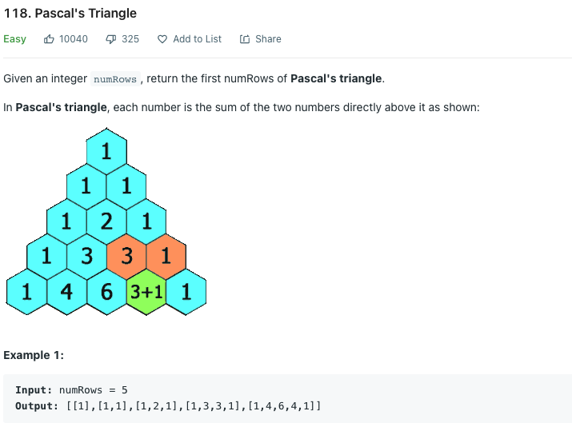

# Set Matrix Zeros

> Let the first col rep which rows are to be marked empty

> Let the first row reprenst which cols are to be marked empty.
> This would cause conflict for (0,0) so we sperate it out as boolean - isFirstColDown

> Handle the first row data excluding (0,0) first as it doesnt overwrite any meta info we stored
> Then you may handlle all first col meta data and then finally the operaion relating to boolean flag

```cpp
class Solution {
public:
    void setZeroes(vector<vector<int>>& matrix) {
        bool isFirstColDown=false;
        int m= matrix.size(), n=matrix[0].size();
        for(int i=0;i<m;i++){
            for(int j=0;j<n;j++){
                if(matrix[i][j]==0){
                    matrix[i][0]=0; // storing row related meta-data for lazy update
                    (j==0) ? isFirstColDown=true : matrix[0][j]=0;// storing col related meta-data for lazy update
                }
            }
        }
        // performing lazy updates - in an order such that meta info is not overwritten before use
        for(int j=1;j<n;j++) if(!matrix[0][j]) for(int i=0;i<m;i++) matrix[i][j]=0;
        for(int i=0;i<m;i++) if(!matrix[i][0]) for(int j=0;j<n;j++) matrix[i][j]=0;
        if(isFirstColDown) for(int i=0;i<m;i++) matrix[i][0]=0;
    }
};
```
# Pascals Triangle

> - 1 0
> - 1 1
> - 1 2 1
> - 1 3 3 1
> - 1 4 6 4 1

> We cant notice how each array is a palindrome ncR
```cpp
class Solution {
public:
    vector<vector<int>> generate(int n) {
        vector<vector<int>> firstNRows;
        vector<int> seed= {1};
        firstNRows.push_back(seed);
        for(int i=1;i<n;i++){
            vector<int> temp(i+1,1);
            int s=1 ; int e=i-1;
            while (s<=e)
                temp[s++]=temp[e--]=firstNRows[i-1][s] + firstNRows[i-1][s-1];
            firstNRows.push_back(temp);
        }
        return firstNRows;
    }
};
```
#
